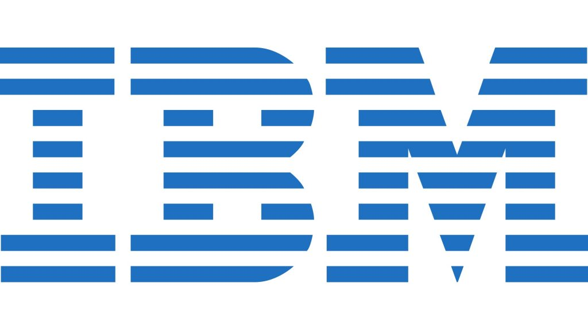

## 🎯 Key Certifications

### 🧠 IBM & Watsonx Series

- **WatsonX Sales Foundation** – IBM  
- **WatsonX Technical Sales Foundations** – IBM  
- **WatsonX Assistant Technical Sales** – IBM  
- **WatsonX Data Sales Foundation** – IBM  
- **WatsonX Governance Technical Sales** – IBM  
- **WatsonX Data Technical Sales** – IBM  

---

### 🛠 Core Infra & Integration
- **IBM MQ Technical Sales Intermediate** – IBM  
- **IBM MQ Sales Foundation** – IBM  
- **CloudPak for Business Automation Sales** – IBM  
- **CloudPak for Integration Sales** – IBM  
- **Red Hat Sales (via IBM)**  

---

### ☁️ Cloud, DevOps & Oracle
- **Oracle Cloud Infrastructure Foundations** – Oracle  
- **Oracle Database SQL Certified Associate** – Oracle  
- **Oracle DevOps Professional** – Oracle  

---

### 🏅 Why It Matters
These credentials reflect my capabilities across:
- **Enterprise data platforms** (Watsonx, Oracle, CloudPak)
- **Integration & messaging systems** (IBM MQ, Red Hat)
- **Cloud & automation** (AWS, OCI, DevOps practices)
- **Pre-sales and technical enablement**

<figure>
  
  <figcaption>Certifications that define my data engineering journey 🚀</figcaption>
</figure>
