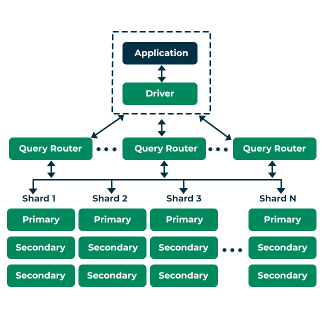
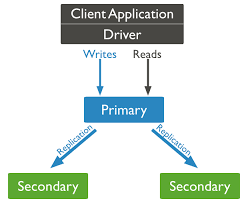

# Introduction

"Knowledge grows when shared, just like data scales with MongoDB."

MongoDB is more than just a database; it’s a modern solution for modern problems. Whether you are working on small-scale projects or enterprise-level applications, understanding MongoDB from the ground up is crucial for every developer. In this blog, we’ll explore MongoDB's basics, dive into advanced topics, and guide you through commands that will help you unlock MongoDB's full potential.

---

## 🏗️ MongoDB Architecture

"A building is only as strong as its foundation."

MongoDB's architecture is based on a distributed database system, which allows for horizontal scaling and high availability. At its core, MongoDB is a **document-oriented database** where data is stored in BSON (Binary JSON) format.



Key architectural components:

- **Collections**: Analogous to tables in relational databases but more flexible.
- **Documents**: BSON format documents that are schema-less and can evolve over time.
- **Replica Sets**: A group of MongoDB instances that provide redundancy and high availability.
- **Sharding**: A method to distribute data across multiple servers.
- **Journaling**: Ensures data durability in case of a crash.

---

## 💻 Installation Procedure on Windows

"Great journeys start with a single step – install MongoDB."

To install MongoDB on Windows:

1. Download MongoDB from the [official MongoDB website](https://www.mongodb.com/try/download/community).
2. Run the installer and follow the setup wizard.
3. Choose "Complete" for the installation type.
4. Once installed, you need to configure the MongoDB path.

```bash
C:\Program Files\MongoDB\Server\in
```

Add this to the Windows environment variables (`Path`) to access MongoDB commands from anywhere in the command line.

Now, you can verify the installation by running:

```bash
mongo --version
```

---

## 💻 Installation Procedure on Linux

"Great journeys start with a single step – install MongoDB on Linux."

1. Open your terminal and install the MongoDB packages:
    ```bash
    sudo apt-get install -y mongodb
    ```

2. Start MongoDB:
    ```bash
    sudo systemctl start mongodb
    ```

3. Verify the installation by running:
    ```bash
    mongo --version
    ```
---

## 📚 MongoDB Basics

"To master the complex, one must first conquer the simple."

MongoDB is known for its flexibility and ease of use. Before diving into advanced operations, let’s cover the basic commands and CRUD operations.

- **Create a database**: MongoDB will automatically create a database when you insert data into a collection.
    ```bash
    use myDatabase
    ```

- **Create a collection**:
    ```bash
    db.createCollection('users')
    ```

- **Insert a document**:
    ```bash
    db.users.insertOne({ name: "John", age: 28, location: "New York" })
    ```

- **Insert multiple documents**:
    ```bash
    db.users.insertMany([{ name: "Jane", age: 32 }, { name: "Sam", age: 24 }])
    ```

- **Find all documents**:
    ```bash
    db.users.find()
    ```

- **Query with filters**:
    ```bash
    db.users.find({ age: { $gt: 25 } })
    ```

- **Update a document**:
    ```bash
    db.users.updateOne({ name: "John" }, { $set: { age: 29 } })
    ```

- **Delete a document**:
    ```bash
    db.users.deleteOne({ name: "Sam" })
    ```

---

## 📊 Data Types in MongoDB

MongoDB supports a wide range of data types. Understanding these is crucial for designing efficient collections and documents.

- **String**: Stores text data.
- **Integer**: Stores numeric values.
- **Boolean**: Stores `true` or `false`.
- **Array**: Stores a list of multiple values.
- **Object**: Stores embedded documents.
- **Date**: Stores dates and times.

```bash
db.products.insertOne({
    name: "Laptop",
    price: 1200,
    tags: ["electronics", "computer"],
    specs: { ram: "16GB", cpu: "Intel i7" },
    available: true,
    releaseDate: new Date()
})
```

---

## 🛠️ Advanced MongoDB Topics

"The deeper the well, the clearer the water – dive deep into MongoDB's advanced features."

### Indexing

Indexing improves the performance of read queries. Without an index, MongoDB performs a full collection scan.

- **Create an index**:
    ```bash
    db.users.createIndex({ age: 1 })
    ```

- **Drop an index**:
    ```bash
    db.users.dropIndex({ age: 1 })
    ```

### Aggregation Framework

The aggregation framework is used for complex data processing and analysis.

- **Basic aggregation pipeline**:
    ```bash
    db.orders.aggregate([
        { $match: { status: "shipped" }},
        { $group: { _id: "$customer_id", totalSpent: { $sum: "$amount" }}}
    ])
    ```

- **Advanced aggregation with multiple stages**:
    ```bash
    db.sales.aggregate([
        { $match: { status: "completed" }},
        { $group: { _id: "$region", totalSales: { $sum: "$amount" }}},
        { $sort: { totalSales: -1 }},
        { $limit: 5 }
    ])
    ```

---

## 🔒 MongoDB Security and Replication

"Just as a fortress guards its treasures, MongoDB secures its data with strong walls."

Security is essential in any database system, and MongoDB provides several mechanisms:

- **Authentication**: Enforce user access through role-based control.
    ```bash
    db.createUser({
      user: "admin",
      pwd: "password123",
      roles: [{ role: "readWrite", db: "admin" }]
    })
    ```

- **Encryption**: MongoDB supports data-at-rest encryption, ensuring that even if the physical storage is compromised, the data remains secure.

- **Replication**: Ensures data redundancy and high availability.
    ```bash
    rs.initiate()
    ```

Replication involves a **primary node** and multiple **secondary nodes**. Data written to the primary node is automatically replicated to the secondary nodes.



---

## ⚙️ Sharding in MongoDB

"Scaling databases to infinity and beyond."

Sharding is MongoDB's solution for handling large datasets by distributing data across multiple servers. This is particularly useful for big data applications.

- **Enable sharding for a collection**:
    ```bash
    sh.enableSharding("myDatabase")
    sh.shardCollection("myDatabase.myCollection", { _id: "hashed" })
    ```

Sharding improves both the performance and scalability of your database by distributing data across **shards**.

---

## 🚀 Conclusion

 MongoDB has transformed the way developers think about and interact with data. From its flexibility in schema design to its powerful aggregation framework, MongoDB empowers developers to build scalable, performant applications. Whether you're just starting with MongoDB or mastering advanced topics like replication and sharding, this guide is your gateway to becoming proficient in MongoDB.

Start with the basics, but don’t hesitate to explore the advanced topics to make the most of this incredible NoSQL database.

Feel free to comment and read [My blogs](https://abdulrahmanh.com/blog).

---
