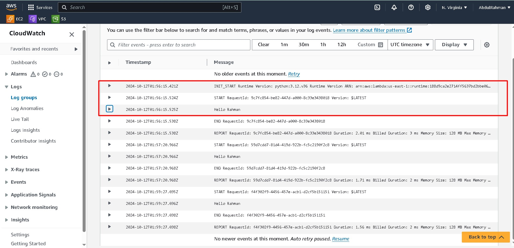

## Introduction

AWS Lambda is a serverless computing service that allows you to run code without provisioning or managing servers. With Lambda, you only pay for what you use, making it an efficient and scalable option for deploying functions in the cloud.

In this blog, we’ll cover:
- **What AWS Lambda is and how it works**
- **Steps to create and deploy an AWS Lambda function using Python**
- **How to trigger Lambda using an IAM Role**

## What is AWS Lambda?

AWS Lambda is a compute service that lets you run code in response to triggers, such as changes in data, system states, or user requests. Lambda handles the infrastructure, scaling, and load balancing for you automatically.


### Key Features:
- **Pay-as-you-go pricing**: You only pay for the compute time you use.
- **Automatic scaling**: Lambda scales your function in response to the incoming requests.
- **No servers to manage**: Lambda abstracts the infrastructure management, allowing developers to focus on writing code.

## How to Create an AWS Lambda Function

### Step 1: Create a Lambda Function

1. Log in to the [AWS Management Console](https://aws.amazon.com/console/) and navigate to **Lambda**.
2. Click **Create function** and select **Author from scratch**.
3. Fill in the details:
    - **Function name**: `MyPythonLambda`
    - **Runtime**: Python 3.12
4. Under **Execution role**, choose **Create a new role with basic Lambda permissions**.


### Step 2: Write the Python Code

In the function code editor, you can write your Lambda function code in Python.

```python
import json

def lambda_handler(event, context):
    message = event.get('message', 'Hello, AWS Lambda!')
    return {
        'statusCode': 200,
        'body': json.dumps({
            'message': message
        })
    }
```

This Lambda function retrieves a message from the event and returns it in the response.

### Step 3: Deploy the Function

After writing the function, click **Deploy**. AWS Lambda will automatically package your code and make it available to handle triggers.


## Step 4: Create an IAM Role to Trigger Lambda

To trigger the Lambda function, you'll need an IAM role with the necessary permissions.

1. Navigate to **IAM** from the AWS console.
2. Click **Roles** and then **Create Role**.
3. Select **Lambda** as the trusted entity.
4. Attach the policy **AWSLambdaBasicExecutionRole**, which grants permissions to write logs to Amazon CloudWatch.
5. Attach the policy **AmazonS3ReadOnlyAccess** if you are triggering the function from S3.
6. Name the role, such as `LambdaS3TriggerRole`.


### Step 5: Set Up a Trigger

You can set up different triggers like **API Gateway**, **S3**, or **CloudWatch Events**. Here’s how to trigger a Lambda function using an S3 bucket:

1. Go to your Lambda function and click on **Add Trigger**.
2. Select **S3** as the source.
3. Choose the S3 bucket and the event type (e.g., **ObjectCreated**).
4. Click **Add** to set up the trigger.

Now, your Lambda function will be triggered whenever an object is uploaded to the specified S3 bucket.


### Example S3 Event:

```json
{
    "Records": [
        {
            "s3": {
                "bucket": {
                    "name": "my-bucket"
                },
                "object": {
                    "key": "my-file.txt"
                }
            }
        }
    ]
}
```

## Step 6: Test the Lambda Function

You can test the function from the Lambda console:

1. Click **Test** on the Lambda function page.
2. Create a new test event and pass a message, for example:
    ```json
    {
        "message": "Hello from S3!"
    }
    ```
3. Run the test and review the output in the **Execution results** tab.

```json
{
  "statusCode": 200,
  "body": "{"message": "Hello from S3!"}"
}
```

## Step 7: View Logs in CloudWatch

You can view the logs in cloudwatch Log Groups




## Additional Tips:
- **Security:** Use the principle of least privilege when assigning IAM roles to Lambda functions.
- **Monitoring:** Lambda integrates with CloudWatch, providing logs, metrics, and tracing to help you monitor the performance of your function.

## Conclusion

AWS Lambda is a powerful service that allows you to build scalable and cost-effective solutions. By combining it with services like S3 and CloudWatch, you can automate workflows and react to changes in your infrastructure or data with ease. The Python code example and IAM role setup discussed here will help you get started with AWS Lambda quickly.


# Cost-Saving Steps After Completing AWS Lambda Tutorial

After completing an AWS Lambda tutorial, it's essential to clean up resources to avoid unnecessary costs. Here's a step-by-step guide to delete resources and minimize costs effectively:

---

## 1. **Delete the AWS Lambda Function**

To prevent further invocations and charges, delete your Lambda function:

- Go to the [AWS Lambda Console](https://console.aws.amazon.com/lambda).
- Find the Lambda function you created.
- Click **Actions** > **Delete** to remove the function.

---

## 2. **Delete Amazon CloudWatch Logs**

CloudWatch stores logs for each Lambda invocation, which can accumulate costs. Delete the logs:

- Navigate to [Amazon CloudWatch](https://console.aws.amazon.com/cloudwatch).
- Go to **Logs** > **Log Groups**.
- Find the log group associated with your Lambda function, usually named `/aws/lambda/<function-name>`.
- Select the log group and click **Delete**.

---

## 3. **Delete Amazon S3 Buckets and Objects (If Applicable)**

If you created S3 buckets for triggers or file storage, make sure to delete them:

- Go to the [S3 Console](https://console.aws.amazon.com/s3).
- Select the bucket you used for your Lambda project.
- Click **Delete** and confirm after ensuring the bucket is empty.

---

## 4. **Delete IAM Roles**

Your Lambda function likely used an IAM role for execution. If this role isn’t used by other services, remove it to avoid any potential security risks:

- Go to [AWS IAM Console](https://console.aws.amazon.com/iam).
- Navigate to **Roles** and find the one associated with your Lambda function (e.g., `AWSLambdaBasicExecutionRole`).
- Click on the role and choose **Delete Role**.

---

## 5. **Remove Amazon S3 Event Triggers (If Applicable)**

If you created an S3 event to trigger your Lambda function, remove the trigger:

- Go to [S3 Console](https://console.aws.amazon.com/s3).
- Open the bucket where the trigger was set up.
- Under **Properties**, find **Event Notifications** and remove the Lambda trigger.

---

## 6. **Delete API Gateway Endpoints or Other Triggers**

If your Lambda function is triggered by an API Gateway or other services like DynamoDB or SNS, remove those triggers:

- Go to the respective service's console (e.g., [API Gateway Console](https://console.aws.amazon.com/apigateway)).
- Find and delete the endpoint or event source that triggers the Lambda function.

---

## 7. **Delete CloudFormation Stack (If Applicable)**

If you deployed your Lambda function using CloudFormation, deleting the stack will automatically remove all associated resources:

- Navigate to [AWS CloudFormation](https://console.aws.amazon.com/cloudformation).
- Select the stack you created and click **Delete** to remove all associated resources.

---

## 8. **Regularly Check AWS Cost Explorer**

Finally, to ensure no residual charges occur, regularly monitor your AWS usage:

- Go to [AWS Cost Explorer](https://aws.amazon.com/aws-cost-management/aws-cost-explorer/).
- Review your resource usage and charges to ensure everything is deallocated correctly.

---

By following these steps, you can minimize costs after completing your AWS Lambda tutorial, ensuring that you only pay for what you use.
  
For more cost-saving tips:

- [AWS Free Tier Services](https://aws.amazon.com/free)
- [AWS Pricing Calculator](https://calculator.aws)
 
For more resources:

- [AWS Lambda Documentation](https://docs.aws.amazon.com/lambda/)
- [AWS IAM Roles](https://docs.aws.amazon.com/IAM/)

### Feel free to comment and view [my blogs](https://abdulrahmanh.com/blog)
