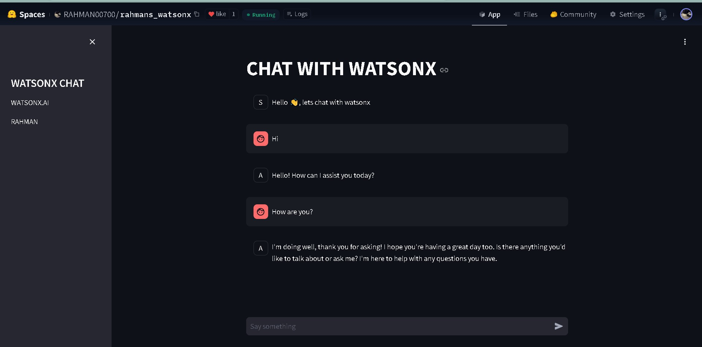

# Introduction

In this blog, we will explore how to build a chatbot application that leverages **IBM Watsonx foundational models**, integrated with a **Streamlit** UI. This project demonstrates how to interact with a large language model (LLM) in real-time, providing a user-friendly interface for dynamic conversations with AI.

The application is built using **Streamlit**, a popular framework for creating interactive web applications in Python. By the end of this guide, you’ll know how to set up the environment, install dependencies, configure your API keys, and run the chatbot locally.

---

## ⚡ Project Overview

The **Chat with Watsonx LLM** project demonstrates a real-time chat interface that interacts with IBM's Watsonx foundational models through Streamlit.

### Key Features:
1. **Real-time Conversations**: Chat with Watsonx's LLM in a dynamic and responsive interface.
2. **Streamlit UI**: Fast and user-friendly interface built using Streamlit.
3. **Customization**: Easily customize the appearance and configurations.

### Technologies Used:
- **Streamlit**: A lightweight web application framework for creating data-driven apps.
- **IBM Watsonx**: IBM’s suite of foundational AI models, providing advanced language understanding.

---

## 🛠️ How to Set Up the Project

Follow the steps below to clone the repository, install dependencies, and run the project locally.

### Step 1: Clone the Repository

First, clone the repository from GitHub:

```bash
git clone https://github.com/Abd-al-RahmanH/Chatbot-with-Watsonx-Models-using-Streamlit.git
cd Chatbot-with-Watsonx-Models-using-Streamlit
```

### Step 2: Create a Virtual Environment

It’s highly recommended to use a virtual environment to manage the project dependencies.

#### For Mac/Linux:

```bash
python3 -m venv venv
source venv/bin/activate
```

#### For Windows:

```bash
python -m venv venv
.\venv\Scripts\activate
```

### Step 3: Install Dependencies

Once the virtual environment is activated, install the project dependencies from the `requirements.txt` file:

```bash
pip install -r requirements.txt
```

### Step 4: Configure API Key and Project ID

#### Step 4.1: Create a `.env` File

For security, it’s recommended to store your API key and project ID in a `.env` file.

1. In the project root directory, create a `.env` file:

   ```bash
   touch .env
   ```

2. Add the following environment variables to the `.env` file:

   ```bash
   API_KEY=your_ibm_watsonx_api_key
   PROJECT_ID=your_ibm_project_id
   ```

   Replace `your_ibm_watsonx_api_key` and `your_ibm_project_id` with the actual values from your IBM Cloud account.

#### Step 4.2: Load the `.env` File

In your `app.py`, ensure you’re loading the environment variables by adding this line to the beginning of the script:

```python
from dotenv import load_dotenv
import os

load_dotenv()
api_key = os.getenv("API_KEY")
project_id = os.getenv("PROJECT_ID")
```

This will securely load your API credentials when running the app.

### Step 5: Run the Application

With all dependencies installed and environment variables configured, you can now run the Streamlit app using the following command:

```bash
streamlit run app.py
```

This will start the application and open it in your default web browser. The interface will allow you to chat with Watsonx LLM in real-time.

---

## 🚀 Show Your Support

If you find this project helpful, don’t forget to give it a ⭐ on GitHub! Your support helps improve the project and keeps it maintained.

--- 

## 🌐 Live Project

You can also view the live project on [Hugging Face](https://huggingface.co/spaces/RAHMAN00700/rahmans_watsonx).


---

## 🔒 License

This project is licensed under the MIT License.

 
