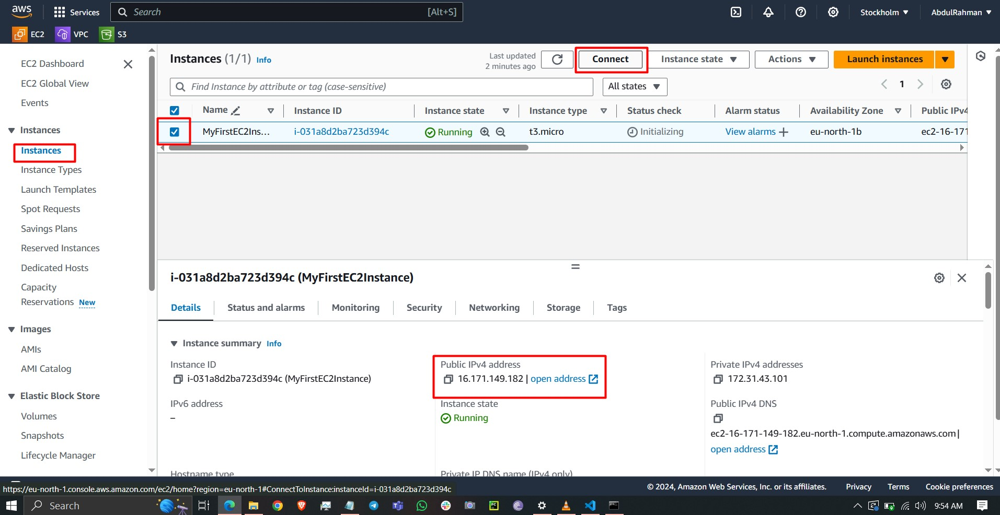
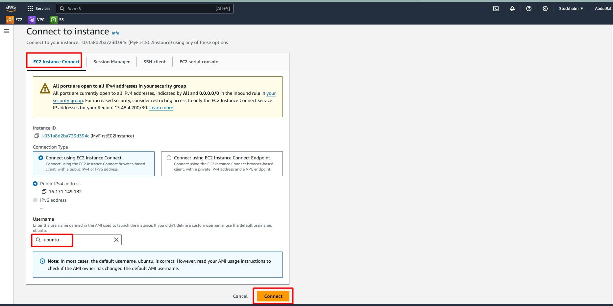
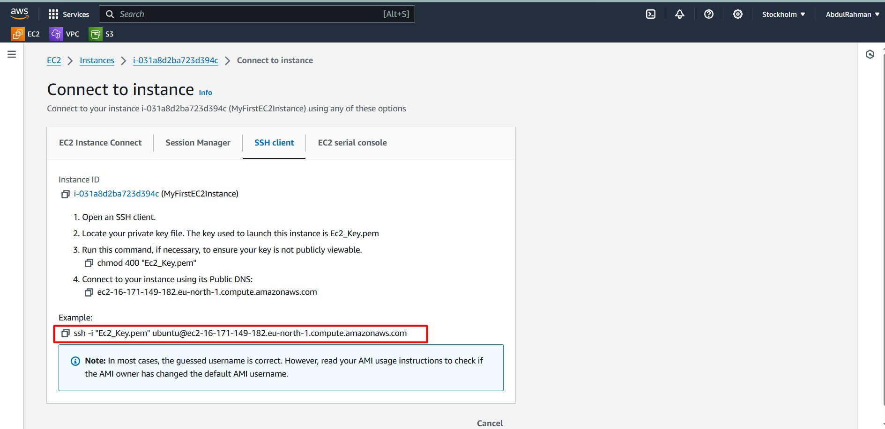

---

**Title:** "How to Create an AWS EC2 Instance (Latest UI)"  
**Excerpt:** "A step-by-step guide to creating an AWS EC2 instance using the latest AWS user interface."  

**Header:**  
  - Image: "../assets/images/posts/2024-08-08-How-to-Create-an-AWS-EC2-Instance/cover.jpg"  
  - Teaser: "../assets/images/posts/2024-08-08-How-to-Create-an-AWS-EC2-Instance/cover.jpg"  
  - Caption: "A single instance in the cloud can scale to move mountains. — Abdul Rahman"  
  - Categories: [AWS, EC2, Cloud]  
  - Tags: [AWS, EC2, Cloud]

---

Creating an EC2 instance in AWS allows you to launch virtual machines (instances) that run on the AWS Cloud. Follow these simple steps to launch your first EC2 instance using the latest AWS UI.


---

## Step 1: Log in to AWS Management Console

Go to the [AWS Management Console](https://aws.amazon.com/console/) and log in. Once inside, search for **EC2** in the search bar and click on **EC2** under "Services."

---

## Step 2: Launch an Instance

Click on **Launch Instance**. You will see a detailed wizard guiding you through the steps to launch your EC2 instance.


---

## Step 3: Name Your Instance and Add Tags

Assign a name to your instance and add tags to help you identify it. For example, set `Name: MyFirstEC2Instance`.

---

## Step 4: Choose an Amazon Machine Image (AMI)

In the **Application and OS Images (Amazon Machine Image)** section, choose an AMI. Options include **Amazon Linux 2023**, **macOS**, **Ubuntu**, **Windows**, and more.  
For this guide, select **Ubuntu** (Free Tier eligible).


---

## Step 5: Choose Instance Type

Select an instance type. For beginners, the **t3.micro** instance (Free Tier eligible) is a great choice. It includes 2 vCPUs and 1 GiB memory. Once selected, click **Next**.

---

## Step 6: Configure Key Pair (Login)

Choose an existing key pair or create a new one to securely connect to your instance. **Download** the private key file (.pem) as you will need it to SSH into your instance.


---

## Step 7: Configure Network Settings

In **Network Settings**, AWS will automatically configure a VPC (Virtual Private Cloud) for you. You can enable **Auto-assign public IP** for external access.  
For most users, the default settings are sufficient.


---

## Step 8: Configure Security Groups (Firewall)

In the **Firewall (Security Groups)** section, define what traffic is allowed to connect to your instance. AWS will create a security group with default rules:

- **SSH** traffic from anywhere (0.0.0.0/0).
- **HTTP** and **HTTPS** traffic from anywhere.

**Important:** For security, it's recommended to restrict SSH access to known IP addresses after initial setup.


---

## Step 9: Configure Storage

By default, AWS allocates 8 GiB of General Purpose (gp3) storage to your instance. The Free Tier allows up to 30 GiB. You can adjust storage size as needed.


---

## Step 10: Review and Launch

Review all configurations. When you're ready, click **Launch**. AWS will prompt you to select your key pair for logging into the instance.

---

## Step 11: Access Your EC2 Instance

Once the instance is launched, return to the **EC2 Dashboard** to view your instance. Select the instance and click **Connect** to access it via the browser's terminal.





---

## Step 12: Connecting via SSH

To connect using a terminal, follow the steps below carefully.



### Example SSH Command:

```bash
ssh -i "your-key.pem" ec2-user@<instance-public-ip>
```

---

## Additional Tips

- **Security**: Initially, you may allow all traffic, but remember to limit access later by modifying the security group rules. Restrict SSH to your specific IP for secure access.
- **Key Management**: Keep your private key (.pem) file safe, as it cannot be recovered later.

---

Congratulations! You've successfully created an **EC2 instance** using the latest AWS UI.

---

**Resources:**

- [AWS EC2 Documentation](https://docs.aws.amazon.com/ec2/)  
- [AWS Free Tier Information](https://aws.amazon.com/free/)

---

 
