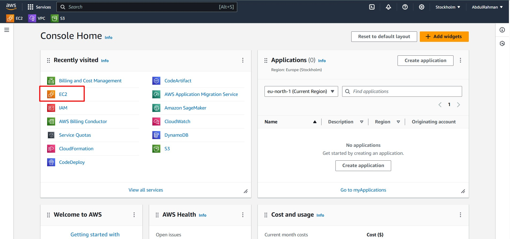
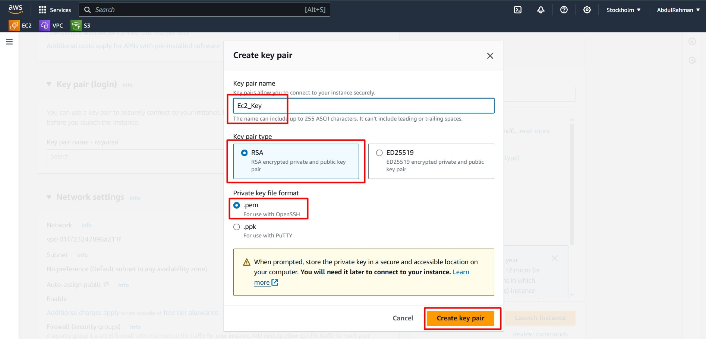
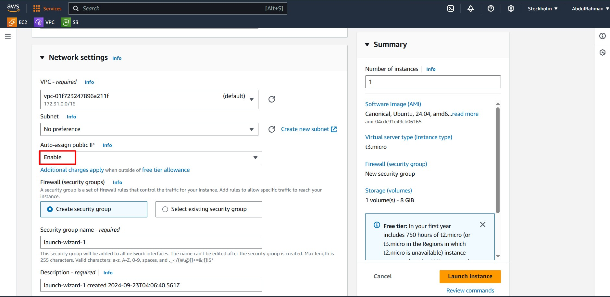
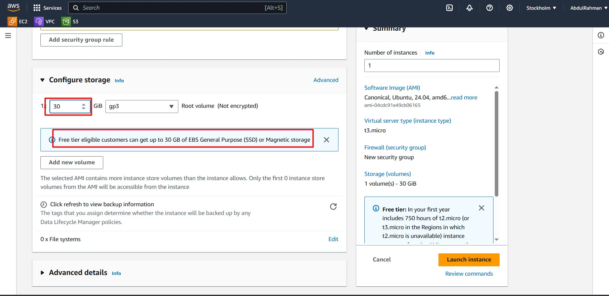

# How to Create an AWS EC2 Instance (Latest UI)

Creating an EC2 instance in AWS allows you to launch virtual machines (instances) that run on the AWS Cloud. Follow these simple steps to launch your first EC2 instance, using the latest AWS UI.



## Step 1: Log in to AWS Management Console

Go to the [AWS Management Console](https://aws.amazon.com/console/) and log in. Once you're in, search for **EC2** in the search bar and click on **EC2** under "Services."

## Step 2: Launch an Instance

Click on **Launch Instance**. You will now see a detailed wizard guiding you through the steps to launch your EC2 instance.


## Step 3: Name Your Instance and Add Tags

The first section allows you to assign a name to your instance and add tags. Tags can help you identify instances, especially when managing multiple instances. For example, set `Name: MyFirstEC2Instance`.

## Step 4: Choose an Amazon Machine Image (AMI)

The **Application and OS Images (Amazon Machine Image)** section allows you to select an AMI. Choose from **Amazon Linux 2023**, **macOS**, **Ubuntu**, **Windows**, or others.

For this example, we'll choose **Ubuntu** (Free tier eligible). You will see the AMI details, including architecture (64-bit), boot mode (UEFI preferred), and username (`ec2-user`).


## Step 5: Choose Instance Type

Choose an instance type. For beginners, the **t3.micro** instance (Free Tier eligible) is a good choice, as it includes 2 vCPUs and 1 GiB memory. Once selected, click **Next**.

## Step 6: Configure Key Pair (Login)

You need a key pair to securely connect to your instance. Either select an existing key pair or create a new one. **Download** the private key file (.pem), as you'll need it to SSH into your instance.



## Step 7: Configure Network Settings

In the **Network Settings**, AWS automatically configures a VPC (Virtual Private Cloud) for you. You can select **Auto-assign public IP** to enable external access.

For most users, keeping the default settings works well.



## Step 8: Configure Security Groups (Firewall)

In the **Firewall (Security Groups)** section, you can define what traffic is allowed to connect to your instance. By default, AWS creates a security group called **launch-wizard-1** with the following rules:

- **SSH** traffic is allowed from anywhere (0.0.0.0/0).
- **HTTP** and **HTTPS** traffic is allowed from anywhere.

**Important:** You can allow **All traffic** temporarily for testing, but for security reasons, restrict access to known IP addresses when in production.


## Step 9: Configure Storage

By default, AWS allocates 8 GiB of General Purpose (gp3) storage to your instance. The Free Tier eligible upto 30 GB. You can increase storage size or add new volumes if needed.


## Step 10: Review and Launch

Review all the configurations you’ve set. Once you're satisfied, click **Launch**. AWS will prompt you to select your key pair (from Step 6) for logging into your instance.

## Step 11: Access Your EC2 Instance

Once the instance is launched, navigate back to the **EC2 Dashboard** to view your instance. choose the instance created and click **Connect** button and in EC2 Instance Connect Follow the below images and connect in browser terminal
[Connect](../assets/images/posts/2024-08-08-How-to-Create-an-AWS-EC2-Instance/8.jpg)
[](../assets/images/posts/2024-08-08-How-to-Create-an-AWS-EC2-Instance/9.jpg)

## step 12:Connecting using cmd or any terminal that supports SSH
Follow the below image plz reade carefully before proceed
[Connect using ssh](../assets/images/posts/2024-08-08-How-to-Create-an-AWS-EC2-Instance/10.jpg)


### Example SSH Command:

```bash
ssh -i "your-key.pem" ec2-user@<instance-public-ip>

```

## Additional Tips:
Security: You can allow all traffic initially, but remember to limit access by modifying security group rules later. Allow SSH only from your specific IP for secure access.
Key Management: Keep your private key (.pem) file safe; you won’t be able to recover it later.

Congratulations! You've successfully created an **EC2 instance** using the latest AWS UI.

For more resources:

[AWS EC2 Documentation](https://docs.aws.amazon.com/ec2/)
[AWS Free Tier Information](https://aws.amazon.com/free/?all-free-tier.sort-by=item.additionalFields.SortRank&all-free-tier.sort-order=asc&awsf.Free%20Tier%20Types=*all&awsf.Free%20Tier%20Categories=*all)

