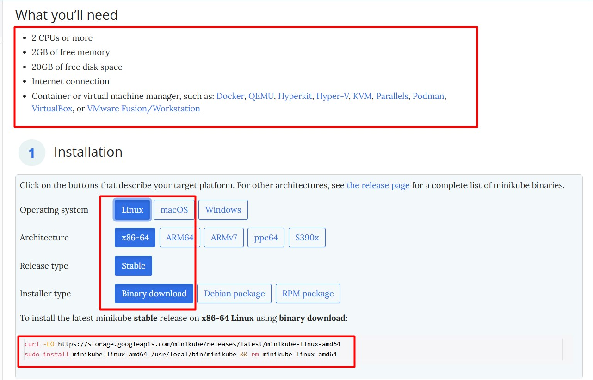
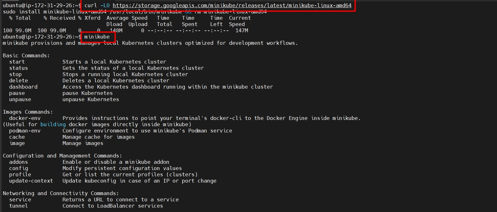
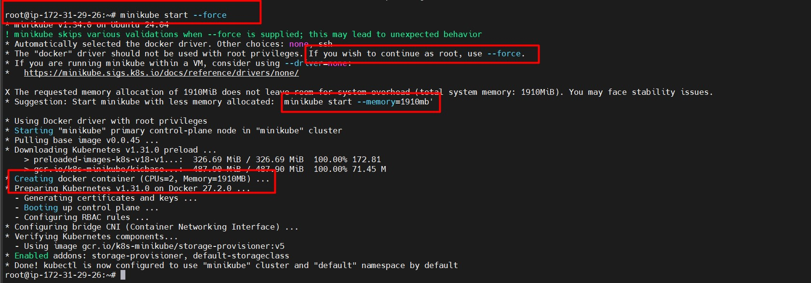
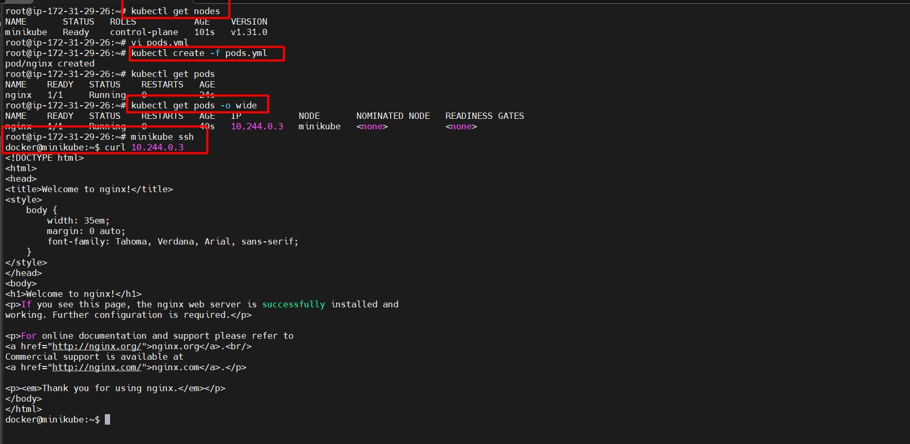
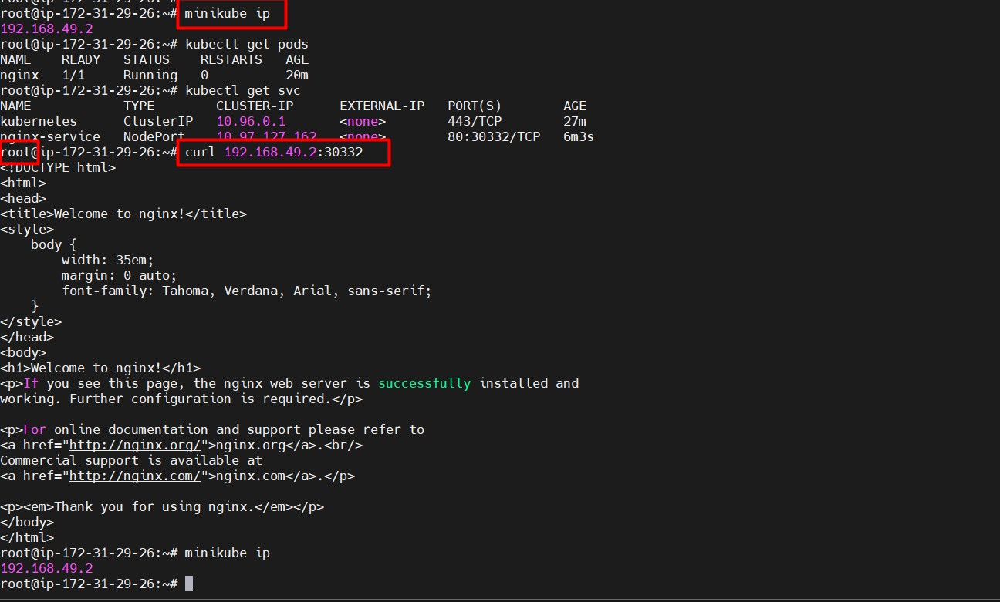

# 🚀 Getting Started with Minikube & Kubernetes on EC2

In this blog, I'll guide you through the steps to Set Up a Kubernetes Single Node Cluster Using Minikube on AWS EC2. If you haven't set up an EC2 instance yet, check out my previous [Blog->Guide to creating an EC2 instance](https://abdulrahmanh.com/blog/How-to-Create-an-AWS-EC2-Instance) before proceeding.

Make sure Instance Size: t2.small (2 CPUs, 30 GB Storage). Note: This setup incurs costs as it's beyond the free tier. Please shut down the instance when not in use to avoid charges."

## Prerequisites

- An active AWS account
- An EC2 instance (preferably Ubuntu)
- Basic knowledge of Linux command line
  
---

## Introduction

Kubernetes is a powerful tool for managing containerized applications at scale. But before diving into large-scale clusters, it's helpful to practice on a smaller, local cluster. That's where **Minikube** comes in!

In this blog, we'll cover the basics of **Minikube**, **kubectl**, and how to manage **pods** and **services (svc)** on an EC2 instance. Let's get started!

---

## 🌟 What is Minikube?
**Minikube** is a tool that allows you to run Kubernetes locally. It creates a single-node Kubernetes cluster that you can use to run Kubernetes commands, deploy apps, and experiment with configurations.

## 📦 What is kubectl?
**kubectl** is a command-line tool that lets you interact with Kubernetes clusters. You can use it to deploy and manage applications, as well as inspect and troubleshoot clusters.

## 🐳 What is a Pod?
A **Pod** is the smallest deployable unit in Kubernetes. It encapsulates containers (like Docker containers) that share the same network namespace and storage. 

## 🔗 What is a Service (svc)?
A **Service** in Kubernetes exposes your application's network on a cluster and connects Pods to the outside world (or to each other). The most common type of Service is **NodePort**, which opens a specific port on all cluster nodes for external traffic.

---

## 💻 Install kubectl on Ubuntu (x86-64)

1. **Update packages:**
    ```bash
    sudo apt update
    ```

2. **Download the latest kubectl release:**
    ```bash
    curl -LO "https://dl.k8s.io/release/$(curl -L -s https://dl.k8s.io/release/stable.txt)/bin/linux/amd64/kubectl"
    ```

3. **(Optional) Validate the binary:**
    ```bash
    curl -LO "https://dl.k8s.io/release/$(curl -L -s https://dl.k8s.io/release/stable.txt)/bin/linux/amd64/kubectl.sha256"
    echo "$(cat kubectl.sha256)  kubectl" | sha256sum --check
    # Output should be: kubectl: OK
    ```

4. **Install kubectl:**
    ```bash
    sudo install -o root -g root -m 0755 kubectl /usr/local/bin/kubectl
    ```

5. **Check version for confirmation:**
    ```bash
    kubectl version --client --output=yaml
 
    ```
## Reference image    


---

## 🚀 Install Minikube

1. **Download Minikube for Linux:**
    ```bash
    curl -LO https://storage.googleapis.com/minikube/releases/latest/minikube-linux-amd64
    ```

2. **Install Minikube:**
    ```bash
    sudo install minikube-linux-amd64 /usr/local/bin/minikube && rm minikube-linux-amd64
    ```
## Reference image    


  


---

## 🛠 Setting up Minikube and Docker

Minikube requires a virtualization platform to create a virtual machine. We’ll use Docker as the virtualization driver.

1. **Install Docker:**
    ```bash
    sudo apt install docker.io -y
    ```

2. **Check Docker version:**
    ```bash
    docker --version
    ```
## Reference image    

    

3. **Start Minikube as root user (important for running within EC2):**
    ```bash
    minikube start --force
    ```

4. **Verify Kubernetes node status:**
    ```bash
    kubectl get nodes
    ```
## Reference image    

    

---

## 📄 Create and Manage Pods

1. **Define a simple NGINX Pod:**
    Create a file called `pods.yml` with the following content:
    ```bash
    vi pods.yml
    ```

    ```yaml
    apiVersion: v1
    kind: Pod
    metadata:
      name: nginx
    spec:
      containers:
      - name: nginx
        image: nginx:1.14.2
        ports:
        - containerPort: 80
    ```
## Reference image  u can get pods and nodes 


2. **Create the NGINX pod:**
    ```bash
    kubectl create -f pods.yml
    ```

3. **List running Pods:**
    ```bash
    kubectl get pods
    ```

4. **Get more details about the pod:**
    ```bash
    kubectl describe pod nginx
    ```

5. **View logs of the NGINX pod:**
    ```bash
    kubectl logs nginx
    ```
## Reference image  U can access nginx pod in minikube ssh see below image

    

---

## 🔗 Expose Pod to Access from EC2 (NodePort)

1. **Label the pod for easier management:**
    ```bash
    kubectl label pod nginx app=nginx
    ```

2. **Expose the NGINX pod using NodePort:**
    ```bash
    kubectl expose pod nginx --type=NodePort --port=80
    ```

3. **List services to find the exposed port:**
    ```bash
    kubectl get svc
    ```

4. **Get the Minikube IP:**
    ```bash
    minikube ip
    ```

5. **Test the service with curl:**
    ```bash
    curl http://<minikube-ip>:<node-port>
    ```
## Reference image  U can access nginx pod in Ec2 level(node) see below image

       

---

## 🔍 Useful Commands for Managing Pods

- **Delete a Pod:**
    ```bash
    kubectl delete pod nginx
    ```

- **List all Pods in wide view:**
    ```bash
    kubectl get pods -o wide
    ```

- **Apply configuration changes to a Pod:**
    ```bash
    kubectl apply -f pods.yml
    ```

---

By following these steps, you've successfully set up Minikube, deployed an NGINX pod, and exposed it externally on EC2 using NodePort. You can now explore more features of Kubernetes!

---

 
