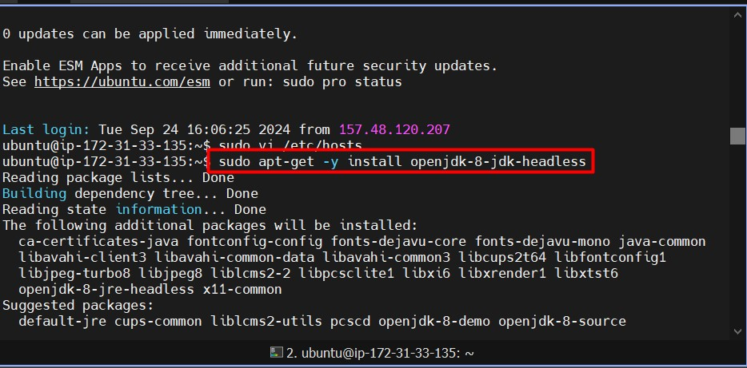
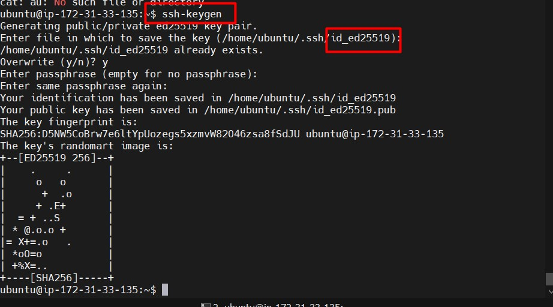
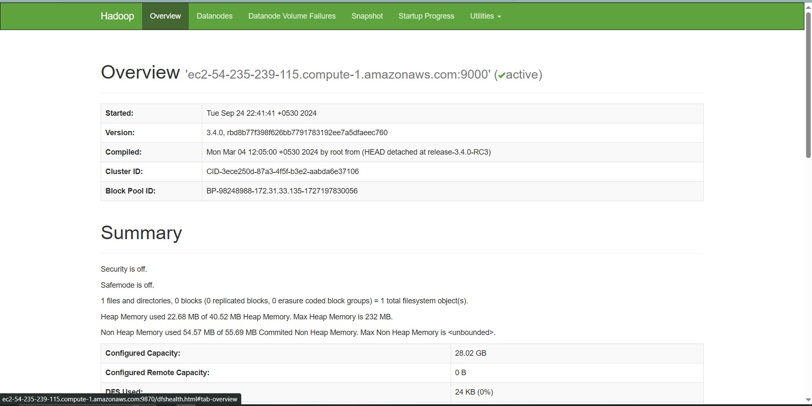

# Introduction
To set up a multi-node Hadoop cluster on AWS EC2, follow the steps below. Ensure you’ve already created 4 EC2 instances (NameNode, Secondary NameNode, DataNode1, DataNode2). If you're unfamiliar with setting up EC2 instances, check out my [Blog->Guide to creating an EC2 instance](https://abdulrahmanh.com/blog/How-to-Create-an-AWS-EC2-Instance) before proceeding. When launching EC2 instances, make sure to specify **4 instances**. 

---
## Pre-requisites

1. **Create AWS EC2 instances:**
   - Launch **4 Ubuntu EC2 instances** for NameNode, Secondary NameNode, and DataNodes(1,2). Assign names to your instances accordingly.

   
2. **SSH into the NameNode**:
    Copy the key pair you created for the EC2 instances to the NameNode. First the locate the pem file and type this below command:
    ```bash
    scp -i Laptopkey.pem Laptopkey.pem ubuntu@<namenode_dns>:~/
    ```

3. **Update and Restart Instances**:
    After logging into the 4 EC2 instances, update and restart them:
    ```bash
    sudo apt-get update && sudo apt-get -y dist-upgrade
    sudo reboot
    ```

4. **Update /etc/hosts**:
    On each 4 instance, update the `/etc/hosts` file:
    ```bash
    sudo vi /etc/hosts
    ```
    Replace `127.0.0.1 localhost` with the private IP and DNS of each instance.
    Eg. `172.31.45.2 ec2-54-172-91-40.compute-1.amazonaws.com`


---
## Install Java and Hadoop

1. **Install Java**:
    Install Java on all instances:
    ```bash
    sudo apt-get -y install openjdk-8-jdk-headless
    ```
   
2. **Download Hadoop**:
    Download and extract Hadoop on all 4 instances:
    ```bash
    wget https://dlcdn.apache.org/hadoop/common/hadoop-3.4.0/hadoop-3.4.0.tar.gz
    tar -xvzf hadoop-3.4.0.tar.gz
    mv hadoop-3.4.0 hadoop
    ```

3. **Update .bashrc**:
    Update the `.bashrc` file on all 4 instances:
    ```bash
    vi ~/.bashrc
    ```
    Add the following lines:
    ```bash
    export JAVA_HOME=/usr/lib/jvm/java-8-openjdk-amd64
    export HADOOP_HOME=/home/ubuntu/hadoop
    export HADOOP_CONF=$HADOOP_HOME/etc/hadoop
    export PATH=$PATH:$JAVA_HOME:$HADOOP_HOME/bin
    ```

4. **Source the .bashrc file**:
    ```bash
    source ~/.bashrc
    ```

---
## Configure Password-less SSH

1. **Generate SSH keys on NameNode(Master)**:
    ```bash
    ssh-keygen  
    ```
      
    Copy the public key to all other 4 nodes:
    ```bash
    scp -i Laptopkey.pem /home/ubuntu/.ssh/id_ed25519.pub ubuntu@ec2-54-172-91-40.compute-1.amazonaws.com:/home/ubuntu/.ssh/id_ed25519.pub
       

    cat ~/.ssh/id_ed25519.pub >> ~/.ssh/authorized_keys
    
    ```

2. **Set up SSH config**:
    Modify `~/.ssh/config` on **NameNode**:
    ```bash
    vi ~/.ssh/config
    ```
    Add the following:
    ```bash
    ```bash
   Host nnode
      HostName <provide namenode-dns here>
      User ubuntu
      IdentityFile ~/.ssh/id_ed25519

   Host snnode
      HostName <provide secondary namenode-dns here>
      User ubuntu
      IdentityFile ~/.ssh/id_ed25519

   Host dnode1
      HostName <provide datanode1 dns here>
      User ubuntu
      IdentityFile ~/.ssh/id_ed25519

   Host dnode2
      HostName <provide datanode2 dns here>
      User ubuntu
      IdentityFile ~/.ssh/id_ed25519
    ```

---

## Set up Hadoop Cluster

1. **Create HDFS Directories on all nodes**:
    ```bash
    sudo mkdir -p /usr/local/hadoop/hdfs/data
    sudo chown -R ubuntu:ubuntu /usr/local/hadoop/hdfs/data
    ```
    
2. **Configure Hadoop Files**:
    Modify the following Hadoop configuration files:

    vi $HADOOP_HOME/etc/hadoop/hadoop-env.sh
    - **hadoop-env.sh**:
        ```bash
        export JAVA_HOME=/usr/lib/jvm/java-8-openjdk-amd64
        ```
        
    vi $HADOOP_HOME/etc/hadoop/core-site.xml
    - **core-site.xml**:
        ```xml
        <configuration>
          <property>
            <name>fs.defaultFS</name>
            <value>hdfs://<namenode_dns>:9000</value>
          </property>
        </configuration>
        ```

    vi $HADOOP_HOME/etc/hadoop/hdfs-site.xml
    - **hdfs-site.xml**:
        ```xml
        <configuration>
          <property>
            <name>dfs.replication</name>
            <value>3</value>
          </property>
          <property>
            <name>dfs.namenode.name.dir</name>
            <value>file:///usr/local/hadoop/hdfs/data</value>
          </property>
        </configuration>
        ```
    vi $HADOOP_HOME/etc/hadoop/mapred-site.xml
    - **mapred-site.xml**:
        ```xml
        <configuration>
          <property>
            <name>mapreduce.framework.name</name>
            <value>yarn</value>
          </property>
        </configuration>
        ```
    vi $HADOOP_HOME/etc/hadoop/yarn-site.xml
    - **yarn-site.xml**:
        ```xml
        <configuration>
          <property>
            <name>yarn.resourcemanager.hostname</name>
            <value><namenode_dns></value>
          </property>
        </configuration>
        ```

    Then cd $HADOOP_HOME/etc/hadoop

3. **Copy Configuration Files to Slaves**

Copy the configuration files from NameNode to the slave nodes:
```bash
scp hadoop-env.sh core-site.xml hdfs-site.xml mapred-site.xml yarn-site.xml ubuntu@<SlaveDNS>:~/hadoop/etc/hadoop/
```

3. **Set up Masters and Slaves**:
    - **masters** (on NameNode and Secondary NameNode):
        ```
        <namenode_dns>
        <secondary_namenode_dns>
        ```

    - **slaves** (on DataNode1 and DataNode2):
        ```
        <datanode1_dns> Should be in Datanode1
        <datanode2_dns> Should be in Datanode2
        ```
    Leave masters file empty in Datanode 1 and 2    

---
## Start the Hadoop Cluster

1. **Format the NameNode**:
    ```bash
    hdfs namenode -format
    ```

2. **Start HDFS and YARN**:
    ```bash
    $HADOOP_HOME/sbin/start-dfs.sh
    $HADOOP_HOME/sbin/start-yarn.sh
    ```
        

3. **Verify Hadoop Cluster**:
    Use the following command on each node to verify the daemons:
    ```bash
    jps
    ```
        

---
## Conclusion

That's it! You now have Apache Hadoop running on a single-node cluster on your EC2 instance. You can access the NameNode UI by visiting `http://<ec2-public-ip>:9870`.

Final output 

   


