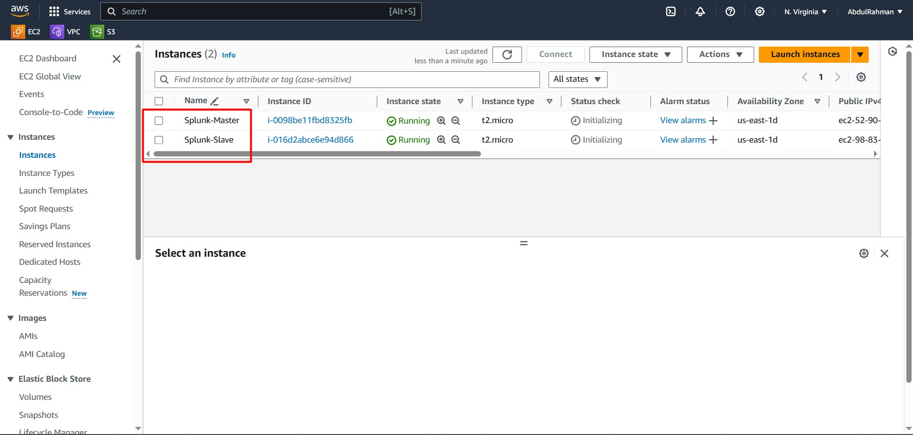
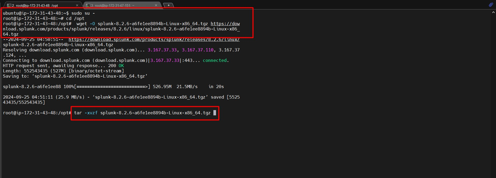
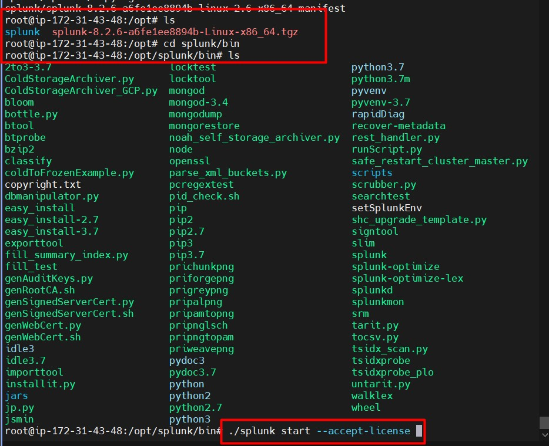
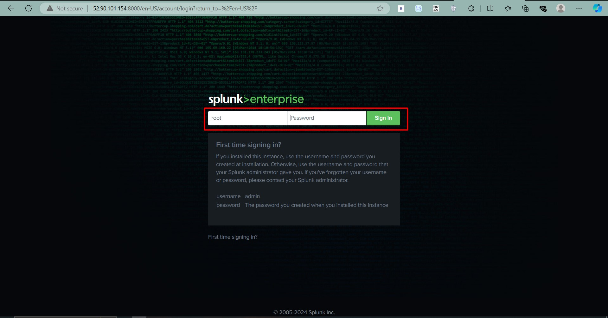
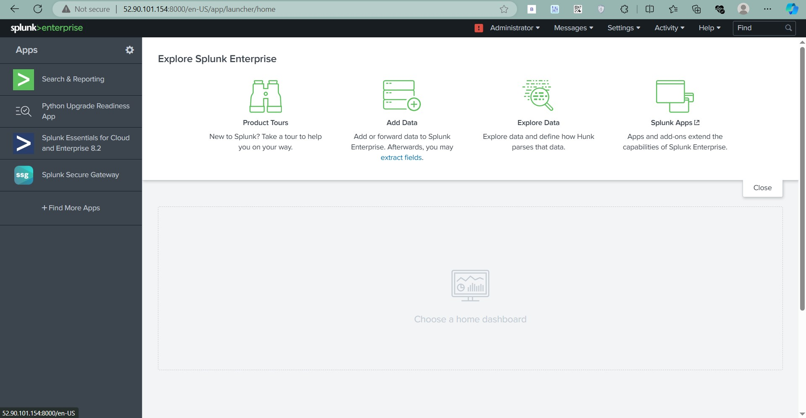
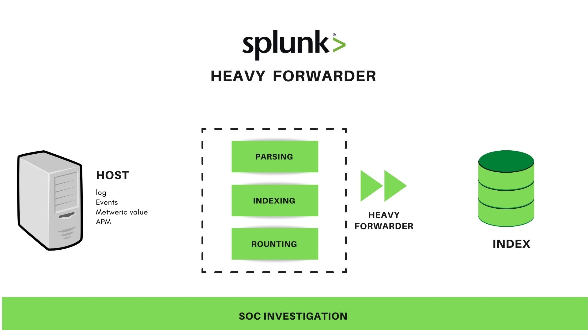

---

title: "How to Install Splunk Enterprise and Universal Forwarder on AWS EC2"
excerpt: "A comprehensive guide to setting up Splunk Enterprise (Master) and Universal Forwarder (Slave) on AWS EC2, covering configuration and running queries."
header:
  image: "../assets/images/posts/2024-09-07-Splunk-Installation/cover.jpg"
  teaser: "../assets/images/posts/2024-09-07-Splunk-Installation/cover.jpg"
  caption: "Unlock the power of data with Splunk. — Abdul Rahman"
  categories: [Splunk, Data, Monitoring]
  tags: [Splunk, Data, AWS, Cloud, EC2]
---

# Introduction

This blog walks you through setting up **Splunk Enterprise (Master)** and a **Universal Forwarder (Slave)** on AWS EC2 instances. It also covers the core components of Splunk, configuration steps, and how to run basic queries. If you haven't already set up your AWS EC2 instances, follow the instructions in my previous blog post,[Guide to Creating an EC2 Instance](https://abdulrahmanh.com/blog/How-to-Create-an-AWS-EC2-Instance) before proceeding.

## Table of Contents
1. [Prerequisites](#prerequisites)
2. [Splunk Master Installation](#splunk-master-installation)
3. [Splunk Slave Installation (Universal Forwarder)](#splunk-slave-installation-universal-forwarder)
4. [Key Components of Splunk](#key-components-of-splunk)
5. [Configuration](#configuration)
   - [Master Configuration](#master-configuration)
   - [Slave Configuration](#slave-configuration)
6. [Adding Data Sources](#adding-data-sources)
7. [Running Queries in Splunk](#running-queries-in-splunk)

---

## Prerequisites

Before you begin the installation, ensure that:
- You have two **AWS EC2 instances**: one for the Splunk Master (Enterprise) and one for the Splunk Slave (Universal Forwarder).
- You have **SSH access** to both instances.
- You have downloaded the Splunk packages from the official [Splunk download page](https://www.splunk.com/en_us/download.html).


If you need assistance setting up the servers, refer to my detailed guide on [Guide to Creating an EC2 Instance](https://abdulrahmanh.com/blog/How-to-Create-an-AWS-EC2-Instance) before proceeding

---

## Splunk Master Installation

Here are the steps to install Splunk Enterprise on the master EC2 instance:

1. **Navigate to the `/opt` directory**:
   ```bash
   cd /opt
   ```

2. **Download the Splunk package**:
   ```bash
   wget -O splunk-8.2.6-a6fe1ee8894b-Linux-x86_64.tgz https://download.splunk.com/products/splunk/releases/8.2.6/linux/splunk-8.2.6-a6fe1ee8894b-Linux-x86_64.tgz
   ```

3. **Extract the package**:
   ```bash
   tar -xvzf splunk-8.2.6-a6fe1ee8894b-Linux-x86_64.tgz
   cd splunk/bin
   ```

4. **Start Splunk**:
   ```bash
   ./splunk start --accept-license
   ```


   

5. **Access the Splunk Web Interface** by visiting the following URL:
   ```plaintext
   http://<your-master-ip>:8000
   ```
   

 6. **Log in with default credentials**:
   - Username: `root`
   - Password: `12345678` (change this on first login).

   

---

## Splunk Slave Installation (Universal Forwarder)

To install the Splunk Universal Forwarder on the slave EC2 instance:

1. **Navigate to the `/opt` directory**:
   ```bash
   cd /opt
   ```

2. **Download the Universal Forwarder package**:
   ```bash
   wget -O splunkforwarder-8.2.6-a6fe1ee8894b-Linux-x86_64.tgz https://download.splunk.com/products/universalforwarder/releases/8.2.6/linux/splunkforwarder-8.2.6-a6fe1ee8894b-Linux-x86_64.tgz
   ```

3. **Extract the package**:
   ```bash
   tar -xvzf splunkforwarder-8.2.6-a6fe1ee8894b-Linux-x86_64.tgz
   cd splunkforwarder/bin
   ```
   

4. **Start the Splunk Forwarder**:
   ```bash
   ./splunk start --accept-license
   ```

5. **Create credentials**:
   - Username: `root`
   - Password: `12345678`
     
---

## Key Components of Splunk

Splunk is built on three essential components:

1. **Search Head**: The interface where you can search, analyze, and visualize data.
2. **Indexer**: Indexes and stores incoming data for quick searches.
3. **Forwarder**: Collects data from various sources and forwards it to the indexer.

These components work together to form a powerful data monitoring and analysis system.



---

## Configuration

### Master Configuration

1. Enable the **Master Server** to listen on port `9997`:
   ```bash
   ./splunk enable listen 9997
   ```
   

### Slave Configuration

1. Add the **Master Server’s IP** to the Slave (Forwarder) configuration:
   ```bash
   ./splunk add forward-server <master-ip>:9997
   ```

2. **Enter Master node credentials**:
   - Username: `root`
   - Password: `12345678`

---

## Adding Data Sources

To forward data, such as **syslog**, from the Slave to the Master:

1. **Add a syslog file** to monitor:
   ```bash
   ./splunk add monitor /var/log/syslog --index main
   ```
   

2. **Alternatively, add a sample log file**:
   ```bash
   cd /var/log
   vi sample_log
   ```

   Enter the sample logs here and save the file. Then navigate back to the Splunk directory:

   ```bash
   cd /opt/splunkforwarder/bin
   ```

   Add the sample log for monitoring:
   ```bash
   ./splunk add monitor /var/log/sample_log --index main
   ```
   

3. Splunk will start indexing the log files from the specified path.


---

## Running Queries in Splunk

Once the data is indexed, you can run **queries** to retrieve and analyze the data.

### Example Query
```spl
index="main" host="slave-node" source="/var/log/syslog" sourcetype="syslog"
```
or simply:
```spl
index="main"
```


This query will fetch logs from the main index where the source is `/var/log/syslog`.

---

By following this guide, you have successfully installed Splunk Enterprise and a Universal Forwarder, configured them, and added data sources. Now, you're ready to dive deeper into Splunk's capabilities!

For more information, visit the [official Splunk documentation](https://docs.splunk.com/).

---

