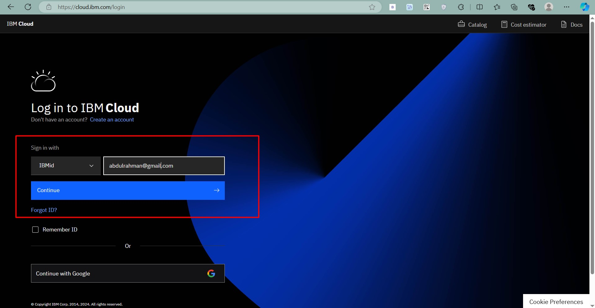
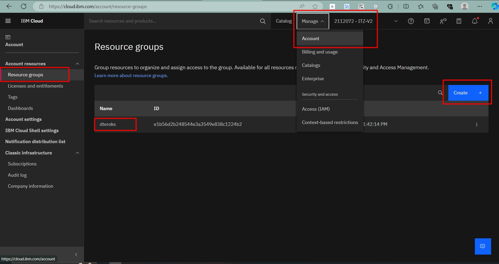
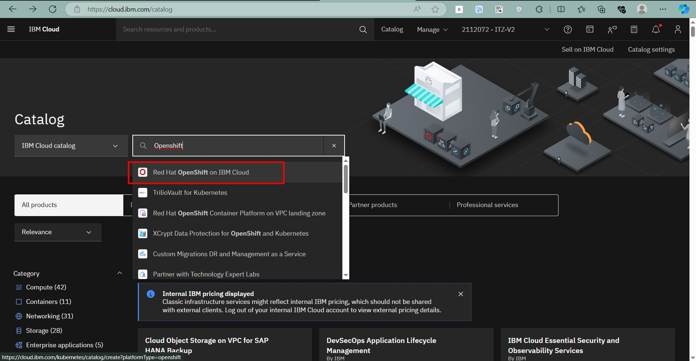
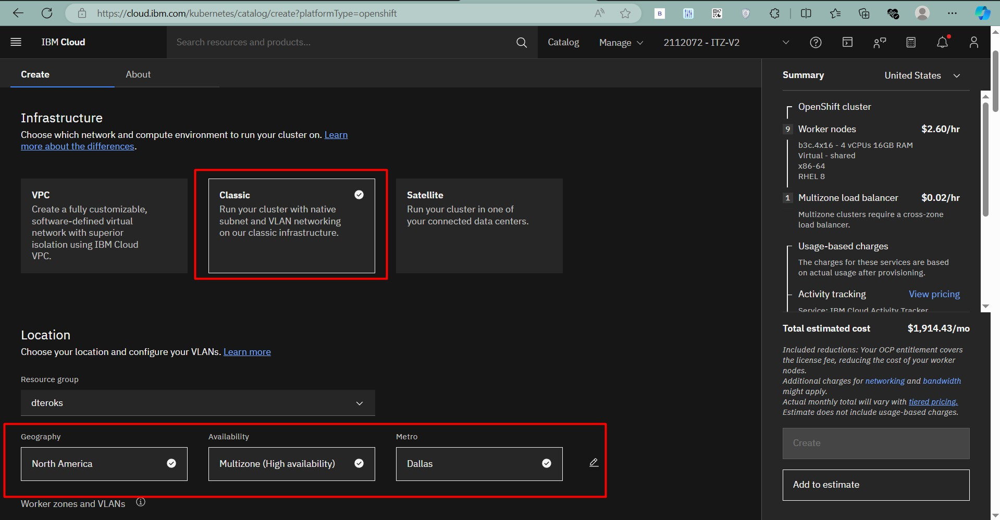
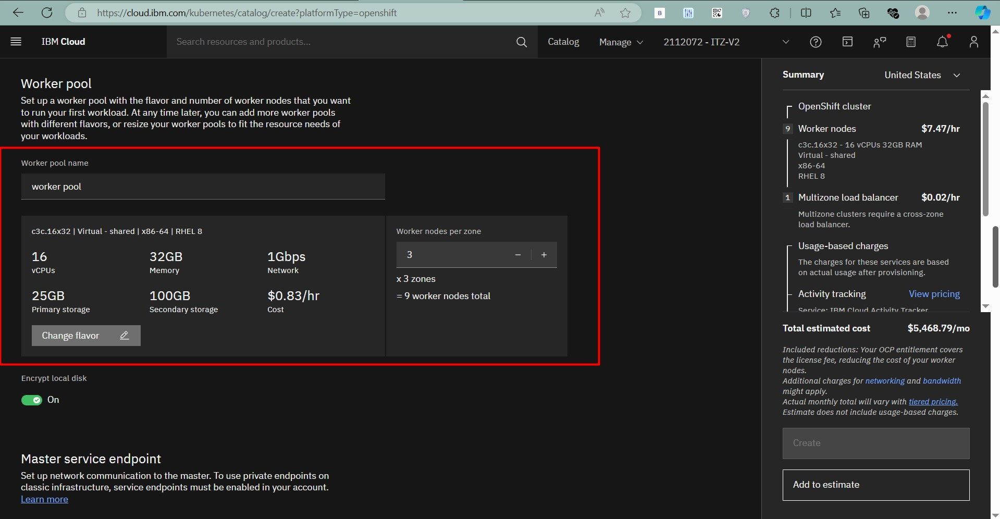
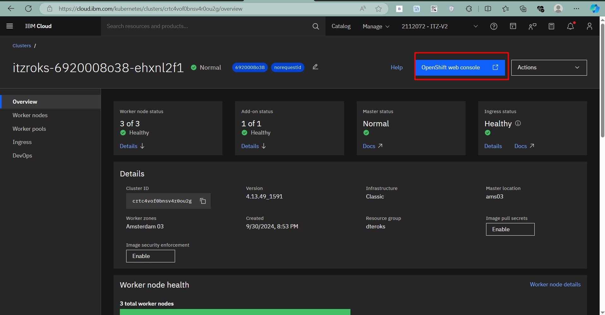

# Introduction

In this blog, we will go through a step-by-step guide on how to create an **OpenShift Cluster** using **IBM Cloud's Red Hat OpenShift on IBM Cloud (ROKS)** service. By the end of this guide, you’ll have a fully functioning OpenShift Container Platform (OCP) cluster running on IBM Cloud.

The **ROKS** (Red Hat OpenShift Kubernetes Service) is a managed OpenShift solution that simplifies cluster deployment and management. This tutorial will use IBM Cloud's console to configure and deploy the cluster.

---

## ⚡ Overview of Creating an OpenShift Cluster in IBM Cloud

The process of creating a cluster involves the following steps:

### Key Steps:
1. **Log in to IBM Cloud**: Access the IBM Cloud console to start the process.
2. **Create a Resource Group**: Group related resources for easy management.
3. **Navigate to OpenShift Services**: Locate the ROKS service and initiate cluster creation.
4. **Configure Cluster Settings**: Define cluster parameters like name, region, and worker nodes.
5. **Review and Create the Cluster**: Confirm settings and create the cluster.
6. **Access the OpenShift Web Console**: Use the OpenShift URL to start managing the cluster.

---

## 🛠️ Step-by-Step Guide to Create an OpenShift Cluster

Follow the steps below to create an OpenShift cluster using IBM Cloud's ROKS service.

### Step 1: Log in to IBM Cloud

- Visit the [IBM Cloud login page](https://cloud.ibm.com/login) and log in using your IBM Cloud credentials.
- After logging in, you will be redirected to the IBM Cloud dashboard.

### Step 2: Create a Resource Group

Creating a resource group helps you manage related resources together:

1. Go to **Manage** > **Account** > **Resource Groups**.
2. Click **Create** and give your resource group a name (e.g., "OpenShift-Resources").
3. Click **Create** to save the resource group.

### Step 3: Navigate to OpenShift Services

1. Click on the **Catalog** from the left panel.
2. Search for **OpenShift** and select **Red Hat OpenShift on IBM Cloud**.
3. Click **Create** to start configuring your cluster.

### Step 4: Configure Cluster Settings

Now, configure the settings for your cluster:

- **Cluster Name**: Choose a unique name for your cluster (e.g., "my-openshift-cluster").
- **Location**: Select the region and zone where you want your cluster to be deployed.
- **Worker Node Count**: Define the number of worker nodes (e.g., 3 nodes for a basic cluster).

### Step 5: Review and Create the Cluster

- Review your configuration and click **Create**.
- The cluster creation process might take 15-30 minutes depending on the configuration.

### Step 6: Access the OpenShift Web Console

Once the cluster is created, access the OpenShift web console:

1. From the IBM Cloud dashboard, go to **Resource List**.
2. In Containers Click on your newly created OpenShift cluster.

3. Click on the **OpenShift Web Console** link.

### Here you had successfully created ROKS cluster in IBM cloud

Use the URL provided to access the OpenShift Console. Use the `oc` CLI or web interface to start managing your cluster resources.

If you want to install and configure **oc - Command line Interface**, Check out my [Get Free OpenShift Dedicated cluster blog](https://abdulrahmanh.com/blog/openshift-dedicated).

---
## 🌐 Additional Resources

If you want to run a sample web app, Check out my Github Page[Openshift-crud-app](https://github.com/Abd-al-RahmanH/Openshift-crud-app).

---
