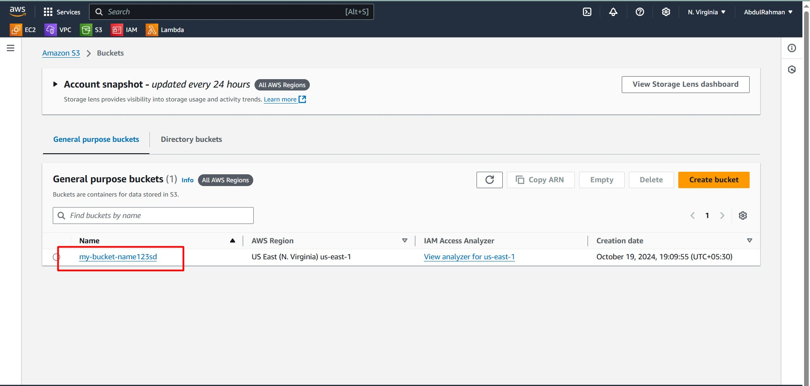
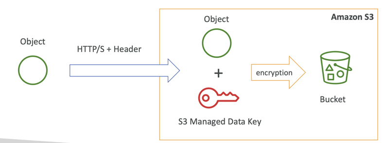
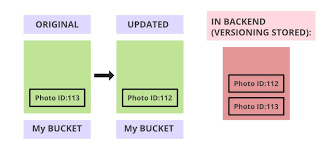
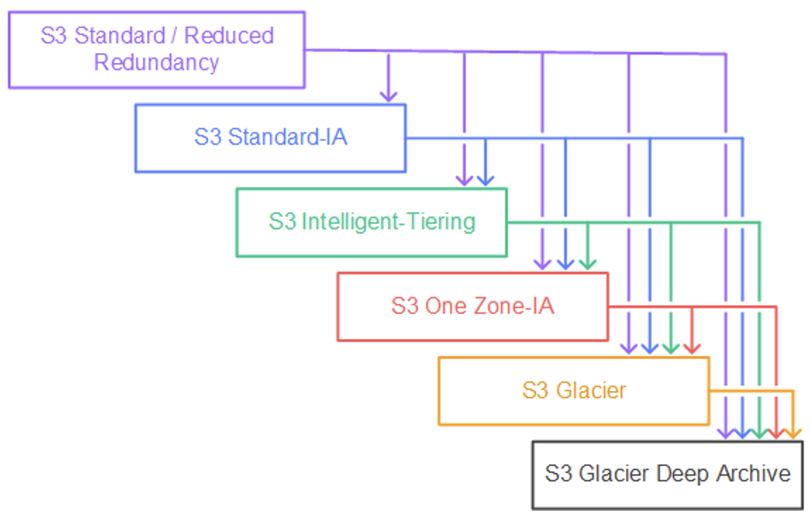

# Introduction

Amazon Simple Storage Service (**AWS S3**) is one of the most popular and versatile cloud storage solutions. In this guide, we will take you from understanding the basics of AWS S3 to mastering advanced features like **versioning**, **lifecycle policies**, and **encryption**.

Whether you're just getting started or looking to fine-tune your knowledge, this blog will cover everything you need to know about **S3 buckets**, **object storage**, and best practices.

---

## 🌐 What is AWS S3?

AWS S3 is a scalable, secure, and durable object storage service that allows users to store and retrieve any amount of data at any time. It provides flexibility and simplicity, making it ideal for a range of use cases, including:

- Backup and restore
- Big data analytics
- Content storage and delivery

For beginners, AWS S3 provides an easy-to-use **GUI** that allows you to create and manage storage buckets directly from the AWS Management Console.

---

## 🗂️ Key Concepts in AWS S3

### 1. **Buckets**

Buckets are the fundamental containers in S3 that hold your data (objects). Each bucket has a globally unique name and can store an unlimited number of objects.

#### GUI Steps:
- Go to the **S3 Management Console**.
- Click on **Create bucket**.
- Enter a unique bucket name and choose a region.

#### Example:
```bash
aws s3 mb s3://my-bucket-name
```



### 2. **Objects**

An object in S3 consists of the data you want to store and its metadata. Each object is uniquely identified within a bucket by a key (the file name).

#### GUI:
- Upload objects via **Add files** in the **AWS Console**.

#### Example:
```bash
aws s3 cp my-file.txt s3://my-bucket-name/
```

---

## 🔐 S3 Security and Access Control

### 1. **Bucket Policies**

Bucket policies define the permissions for accessing the bucket and its objects. You can configure public access or restrict it to specific users.

#### GUI Steps:
1. Open the **S3 Console**.
2. Navigate to **Permissions** for your bucket.
3. Edit the **Bucket policy** to control access.

#### Example Policy:
```json
{
  "Version": "2012-10-17",
  "Statement": [
    {
      "Effect": "Allow",
      "Principal": "*",
      "Action": "s3:GetObject",
      "Resource": "arn:aws:s3:::my-bucket-name/*"
    }
  ]
}
```



### 2. **Encryption**

S3 provides several options for encrypting your data, both at rest and in transit.

- **Server-Side Encryption (SSE)** with Amazon S3-managed keys (SSE-S3).
- **Client-Side Encryption** for encrypting data before uploading.

---

## 📜 Versioning in AWS S3

S3 versioning allows you to store multiple versions of an object in the same bucket, enabling rollback in case of accidental deletion or overwriting.

#### GUI Steps to Enable Versioning:
1. Open the **S3 Management Console**.
2. Select your bucket.
3. Click on **Properties** and enable **Versioning**.

#### Enabling Versioning via CLI:
```bash
aws s3api put-bucket-versioning --bucket my-bucket-name --versioning-configuration Status=Enabled
```



---

## 🔄 S3 Lifecycle Policies

Lifecycle policies help manage the lifecycle of your objects by automating transitions between storage classes and expiring outdated objects.

#### GUI Steps:
1. Go to **Management** tab in the S3 console.
2. Click **Create lifecycle rule** to configure rules for moving or deleting objects based on time.

#### Example Lifecycle Policy:
```json
{
  "Rules": [
    {
      "ID": "Archive older objects",
      "Prefix": "",
      "Status": "Enabled",
      "Transitions": [
        {
          "Days": 30,
          "StorageClass": "GLACIER"
        }
      ],
      "Expiration": {
        "Days": 365
      }
    }
  ]
}
```



---

## 🔧 Installing AWS CLI (Advanced)

For advanced users, installing the **AWS CLI** allows you to manage S3 from the command line.

#### Installation (Windows)

1. Download the installer from [AWS CLI Installer for Windows](https://docs.aws.amazon.com/cli/latest/userguide/install-cliv2-windows.html).
2. Run the installer and follow the prompts.
3. Verify installation by typing the following in **Command Prompt**:

```bash
aws --version
```

---

## 🛠️ Advanced Features for Pro Users

### 1. **S3 Object Lock**

S3 Object Lock enables you to store objects using a write-once-read-many (WORM) model to help meet regulatory requirements.

### 2. **S3 Replication**

You can replicate objects across different regions for redundancy or compliance with S3 Cross-Region Replication (CRR).

Advanced operations like creating buckets or uploading files via CLI:

```bash
aws s3 mb s3://my-bucket-name
aws s3 cp my-file.txt s3://my-bucket-name/
```

---

## 🚀 Best Practices for AWS S3

1. Enable **versioning** for critical data.
2. Use **S3 Intelligent-Tiering** to optimize storage costs.
3. Set up **lifecycle policies** to archive infrequently accessed data.
4. Regularly audit your security settings using AWS **CloudTrail** and **CloudWatch**.

---

## 📈 Conclusion

AWS S3 is a robust, versatile storage solution suitable for both beginners and advanced users. Whether you're managing backups or serving data-intensive applications, mastering S3 will enhance your cloud computing skills.
