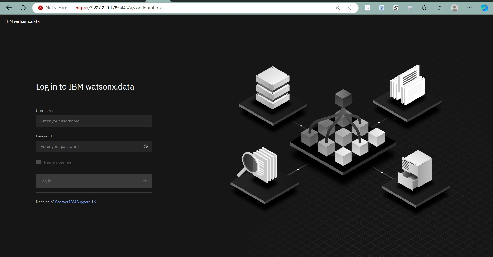
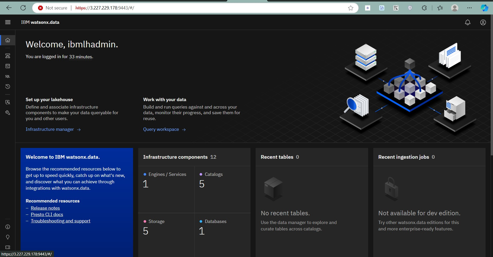
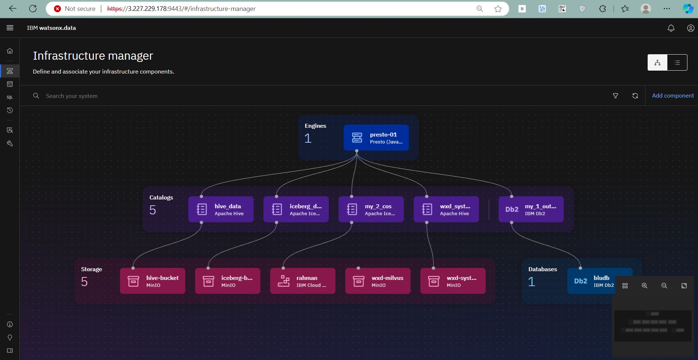
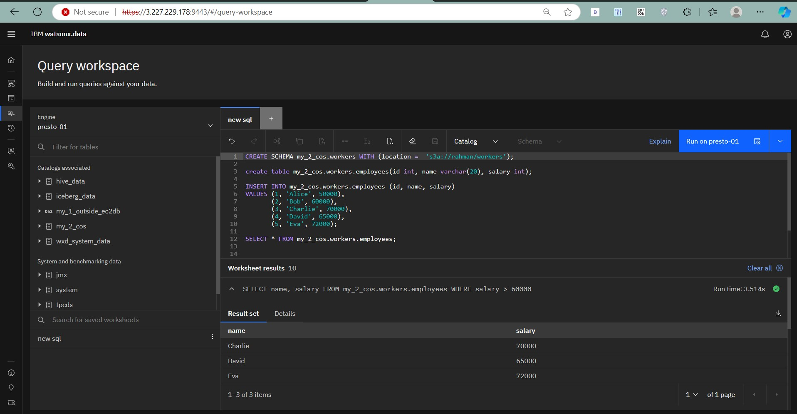
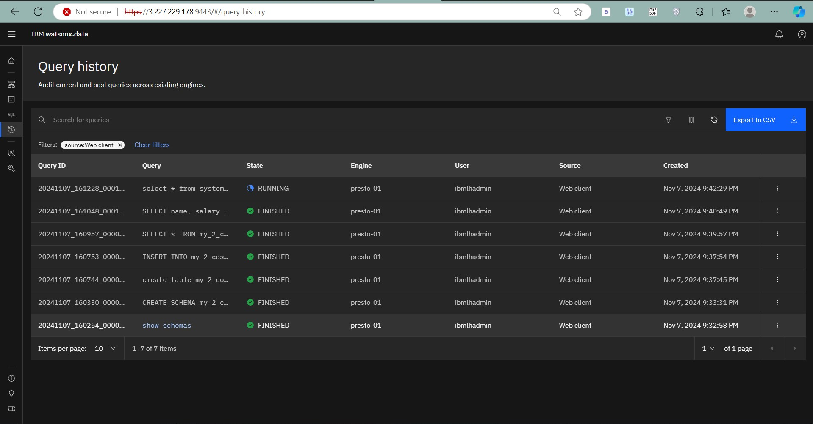

Setting up **IBM Watsonx Data 2.0 Developer Edition** on an Ubuntu EC2 instance enables you to leverage IBM's data lakehouse capabilities on the cloud. This guide provides detailed steps, from configuring entitlement to starting the Watsonx Data containers.

For guidance on creating an EC2 instance, check out my previous blog: [How to Create an AWS EC2 Instance](https://abdulrahmanh.com/blog/How-to-Create-an-AWS-EC2-Instance).Make sure the instance type bigger **eg.t3.xlarge** and allow **All traffic**

---

## Prerequisites

Ensure that you have:
- An **IBM Entitlement Key** for Watsonx Data.
- An Ubuntu EC2 instance in AWS.

## Step 1: Set Up Entitlement Key

1. Log in to your [IBM container library](https://myibm.ibm.com/products-services/containerlibrary).
2. Go to **Add New key** and create a new API key for entitlement.
3. Store the API key securely, as you'll need it for the Watsonx Data installation.

---

## Step 2: Install Docker

Watsonx Data requires Docker to manage its containers. Install Docker as follows:

```bash
# Update package information
sudo apt update

# Install Docker
sudo apt install -y docker.io

# Start Docker service
sudo systemctl start docker
sudo systemctl enable docker
```

Verify Docker installation:

```bash
docker --version
```

---

## Step 3: Set Up Installation Directory and Environment Variables

Switch to root user, create an installation directory, and set the necessary environment variables.

```bash
sudo su -
mkdir watsonxdata
cd watsonxdata

# Set environment variables
export LH_ROOT_DIR=<NEW DIRECTORY-watsonxdata>
export LH_RELEASE_TAG=latest
export IBM_LH_TOOLBOX=cp.icr.io/cpopen/watsonx-data/ibm-lakehouse-toolbox:$LH_RELEASE_TAG
export LH_REGISTRY=cp.icr.io/cp/watsonx-data
export PROD_USER=cp
export IBM_ENTITLEMENT_KEY=<YOUR_IBM_ENTITLEMENT_KEY>
export IBM_ICR_IO=cp.icr.io
```
Replace `<YOUR_IBM_ENTITLEMENT_KEY>` with the key obtained in Step 1.

For Docker, set `DOCKER_EXE` as follows:

```bash
export DOCKER_EXE=docker
```
---

## Step 4: Download and Extract Watsonx Data Developer Package

1. Pull the Watsonx Data developer package and copy it to the host system:

   ```bash
   $DOCKER_EXE pull $IBM_LH_TOOLBOX
   id=$($DOCKER_EXE create $IBM_LH_TOOLBOX)
   $DOCKER_EXE cp $id:/opt - > /tmp/pkg.tar
   $DOCKER_EXE rm $id
   ```

2. Extract the package and verify the checksum:

   ```bash
   tar -xf /tmp/pkg.tar -C /tmp
   cat /tmp/opt/bom.txt
   cksum /tmp/opt/*/*
   tar -xf /tmp/opt/dev/ibm-lh-dev-*.tgz -C $LH_ROOT_DIR
   ```

---

## Step 5: Authenticate with IBM Registry

Log in to the IBM registry to authenticate and pull additional resources:

```bash
$DOCKER_EXE login ${IBM_ICR_IO} --username=${PROD_USER} --password=${IBM_ENTITLEMENT_KEY}
```
---

## Step 6: Run Setup Script

Run the setup script to initialize the Watsonx Data Developer environment. You can set a custom password with the `--password` option; otherwise, the default password is `password`.

```bash
$LH_ROOT_DIR/ibm-lh-dev/bin/setup --license_acceptance=y --runtime=$DOCKER_EXE
```

---

## Step 7: Start Watsonx Data Containers

Start the Watsonx Data containers using the following command:

```bash
$LH_ROOT_DIR/ibm-lh-dev/bin/start
```

---

## Step 8: Access Watsonx Data Console

1. Open the Watsonx Data console by visiting `https://<YOUR_EC2_PUBLIC_IP>:9443` (or the port specified during setup).
2. Log in with the username `ibmlhadmin` and the password you set during setup (default is `password`).

---

## Managing Watsonx Data

### Check Container Status

To view the status of all containers:

```bash
$LH_ROOT_DIR/ibm-lh-dev/bin/status --all
```

### Stop All Containers

To stop all containers:

```bash
$LH_ROOT_DIR/ibm-lh-dev/bin/stop
```

### Start/Stop a Specific Container

To manage individual containers, use `stop_service` and `start_service` commands. Replace `<container_name>` with the name from the `docker ps` output:

```bash
$LH_ROOT_DIR/ibm-lh-dev/bin/stop_service <container_name>
$LH_ROOT_DIR/ibm-lh-dev/bin/start_service <container_name>
```
---

---

## Step 9: Log In to Watsonx Data

Once Watsonx Data is up and running, access the login page via your browser at `https://<YOUR_EC2_PUBLIC_IP>:9443`.


> **Login Page**: Enter your username and password to access the Watsonx Data console.

After that you will see the Dashboard



---

## Step 10: Infrastructure Manager

After logging in, navigate to the **Infrastructure Manager** to monitor and manage system resources and services.


> **Infrastructure Manager**: View and control Watsonx Data's underlying infrastructure and resource allocations.

---

## Step 11: Explore the Query Workspace

Use the **Query Workspace** to write and run SQL queries directly within Watsonx Data.


> **Query Workspace**: Execute SQL queries and analyze data with Watsonx Data's SQL editor.

---

## Step 12: Access Query History

The **Query History** section lets you review past queries, making it easy to track, repeat, or debug previous SQL commands.


> **Query History**: Review and manage past queries for efficient workflow management.

---
---

Congratulations! You have successfully installed and configured **IBM Watsonx Data 2.0 Developer Edition** on your Ubuntu EC2 instance.

**Resources:**
- [IBM Watsonx Data Documentation](https://www.ibm.com/docs/en/watsonx)
- [Docker Documentation](https://docs.docker.com/)

For more insights, check out my [Blog Section](https://abdulrahmanh.com/blog).
