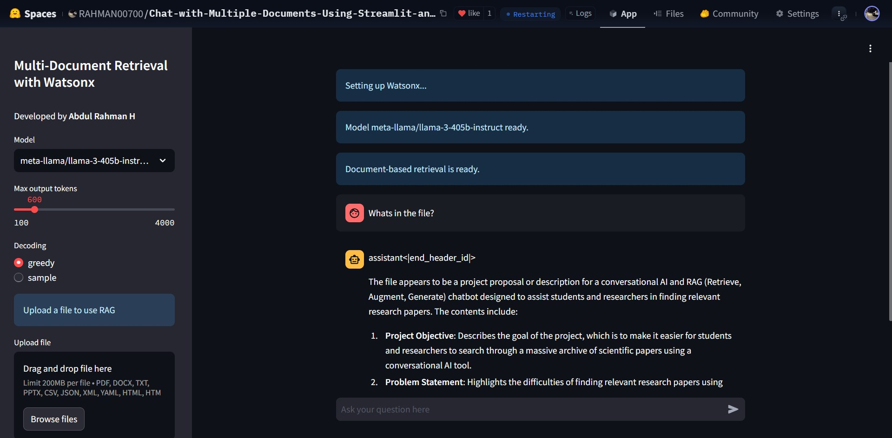
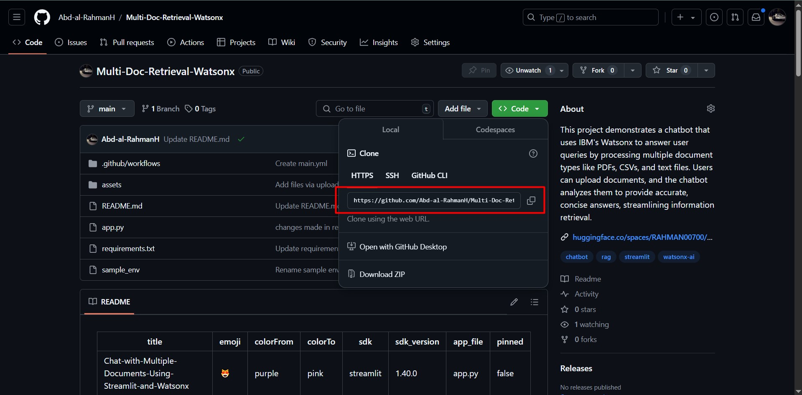
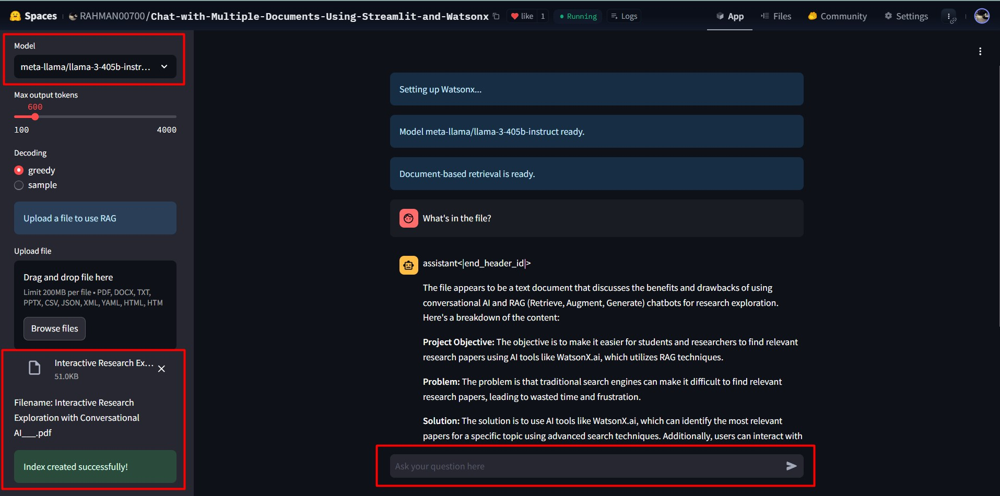

# Introduction

The ability to extract meaningful information from multiple document types (like PDFs, DOCX, CSV, JSON, and more) has become essential for businesses and researchers. This blog explains how to build a Streamlit app that integrates **Watsonx.ai**, **LangChain**, and retrieval-augmented generation (RAG) to make querying documents seamless and efficient.

## Live App
[Link to live app](https://huggingface.co/spaces/RAHMAN00700/Chat-with-Multiple-Documents-Using-Streamlit-and-Watsonx)



---

## What is RAG?

**Retrieval-Augmented Generation (RAG)** is a technique that combines document retrieval with large language models (LLMs) to generate accurate and context-based responses. It retrieves relevant information from your documents before generating answers, making it highly effective for specialized queries.

---

## What is Watsonx.ai?

**IBM Watsonx.ai** is IBM's next-generation platform for foundation models and generative AI. It offers pre-trained language models that can be fine-tuned for tasks like document querying, answering questions, and more. In this project, Watsonx.ai acts as the backbone for generating context-aware answers.

---

## What is LangChain?

**LangChain** is a framework for developing applications powered by LLMs. It simplifies tasks like document retrieval, question answering, and conversation handling by connecting LLMs with tools like embeddings and databases.

---

## What is Streamlit?

**Streamlit** is a Python-based framework for building data-driven web apps quickly. It provides an intuitive interface for users to interact with your application, making it an ideal choice for creating this multi-document retrieval tool.

---
## Features

- **File Support**: Supports multiple file formats such as PDFs, Word documents, PowerPoint presentations, CSV, JSON, YAML, HTML, and plain text.
- **Watsonx LLM Integration**: Utilize IBM Watsonx's LLM models for querying and generating answers.
- **Embeddings**: Uses `HuggingFace` embeddings for document indexing.
- **RAG (Retrieval Augmented Generation)**: Combines document-based retrieval with LLMs for accurate responses.
- **Streamlit Interface**: Provides an intuitive user experience.

---

## Installation

Follow these steps to clone and run the project locally:

### Prerequisites

1. **Python 3.8+** installed on your system.
2. Install `pip` (Python package manager).
3. An IBM Watsonx API key and Project ID.
4. Install Git if not already installed.

### Clone the Repository

```bash
git clone https://github.com/Abd-al-RahmanH/Multi-Doc-Retrieval-Watsonx.git
cd Multi-Doc-Retrieval-Watsonx
```


### Install Dependencies

1. Create a virtual environment (optional but recommended):

    ```bash
    python -m venv env
    source env/bin/activate  # On Windows: .\env\Scripts\activate
    ```

2. Install required Python packages:

    ```bash
    pip install -r requirements.txt
    ```

### Set Environment Variables

Create a `.env` file in the project directory with the following keys:

```bash
WATSONX_API_KEY=<your_watsonx_api_key>
WATSONX_PROJECT_ID=<your_watsonx_project_id>
```

### Run the App

1. Start the Streamlit app by running:

    ```bash
    streamlit run app.py
    ```

2. Open the URL displayed in your terminal (usually [http://localhost:8501](http://localhost:8501)) to access the app.

---

## How to Use

1. **Upload Documents**: Drag and drop supported files (e.g., PDFs, DOCX, JSON) in the app sidebar.
2. **Select Model and Parameters**: Choose a Watsonx model and configure settings like output tokens and decoding methods.
3. **Ask Questions**: Enter queries in the chat input to retrieve answers based on the uploaded document.


---

## Project Structure

```plaintext
Multi-Doc-Retrieval-Watsonx/
├── app.py               # Main application file
├── requirements.txt     # Python dependencies
├── README.md            # Project documentation
└── .env                 # Environment variables (not included in repo, create manually)
```

---

## Dependencies

- **Streamlit**: For building the user interface.
- **LangChain**: For document retrieval and RAG implementation.
- **HuggingFace Transformers**: For embedding and vector representation.
- **Watsonx Foundation Models**: For querying and text generation.
- **Various Python Libraries**: For file handling, including `pandas`, `python-docx`, `python-pptx`, and more.

---

## Contributing

We welcome contributions! If you'd like to improve this project:

1. Fork the repository.
2. Create a feature branch: `git checkout -b feature-name`.
3. Commit your changes: `git commit -m 'Add a new feature'`.
4. Push to the branch: `git push origin feature-name`.
5. Open a Pull Request.

---

## More Blogs and Interesting Projects

For more blogs and interesting projects, visit my personal website: [https://abdulrahmanh.com](https://abdulrahmanh.com)

## License

This project is licensed under the MIT License. See the [LICENSE](LICENSE) file for details.

---
