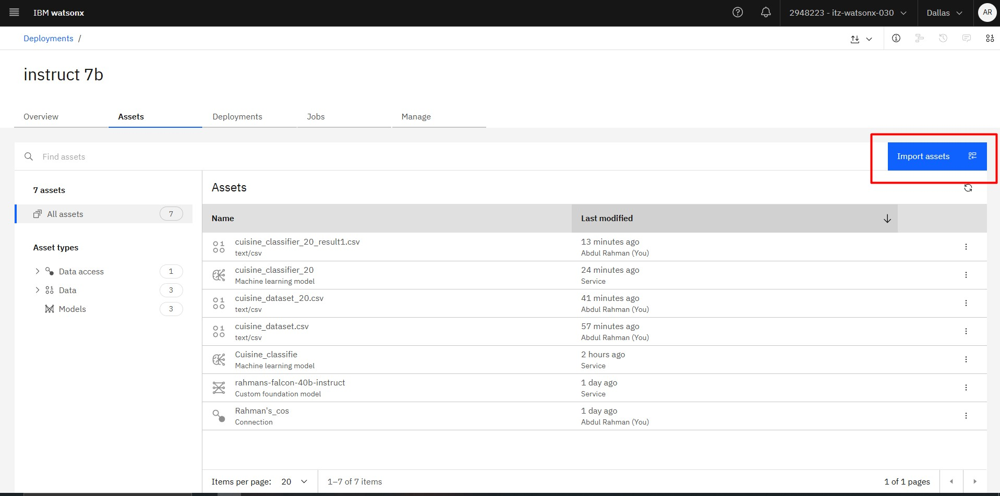
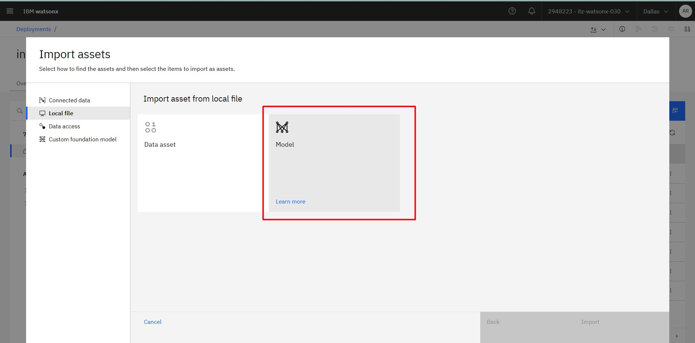
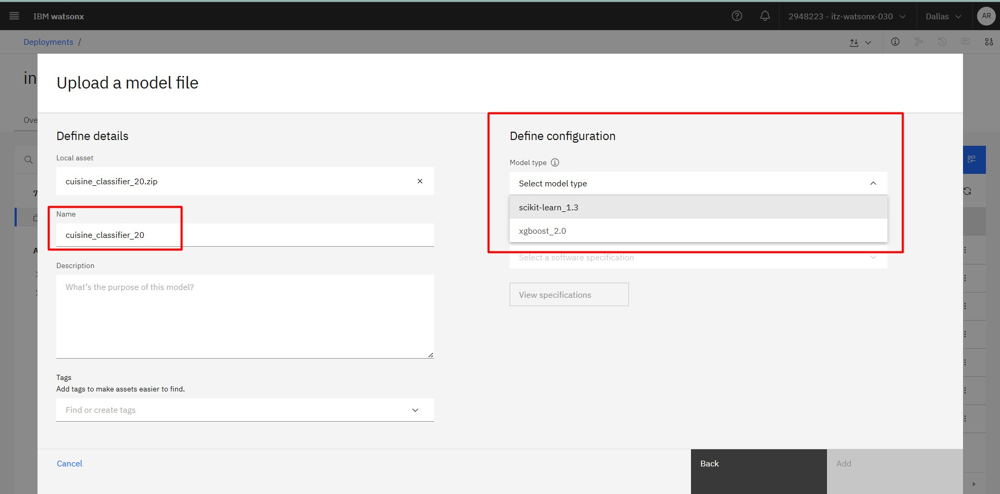
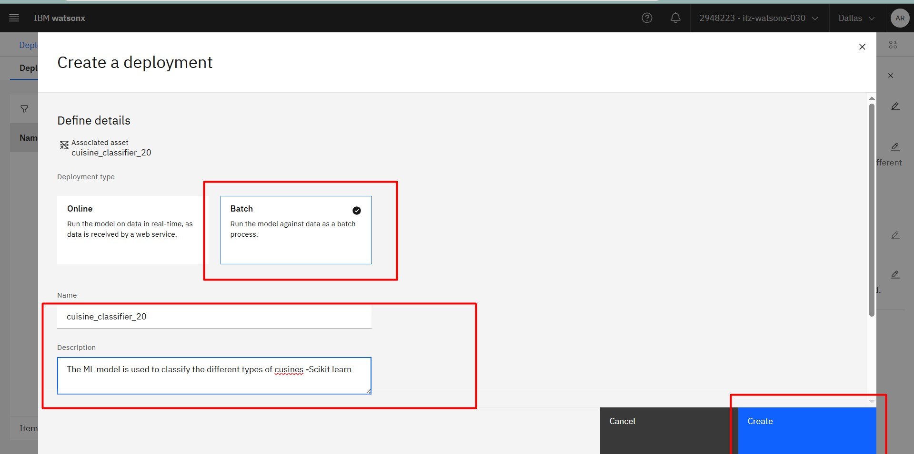
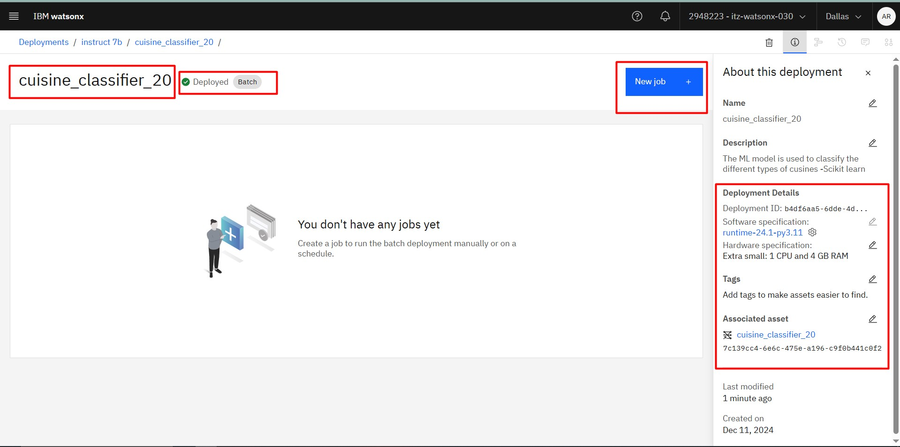
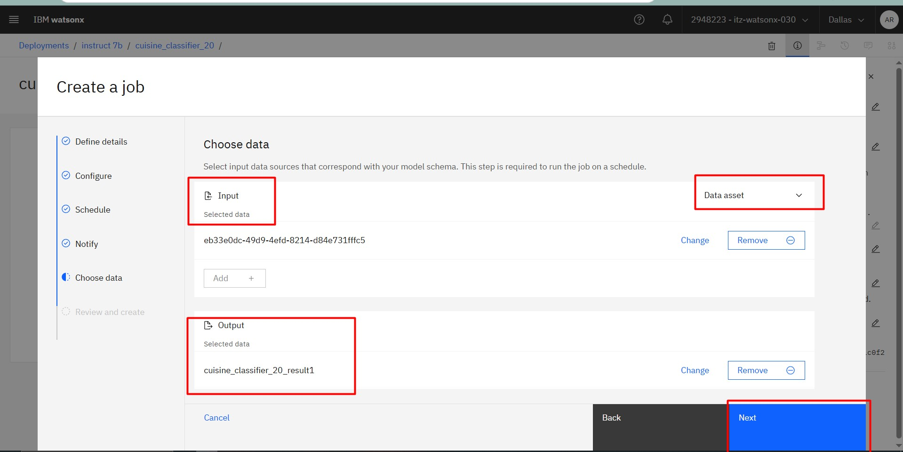
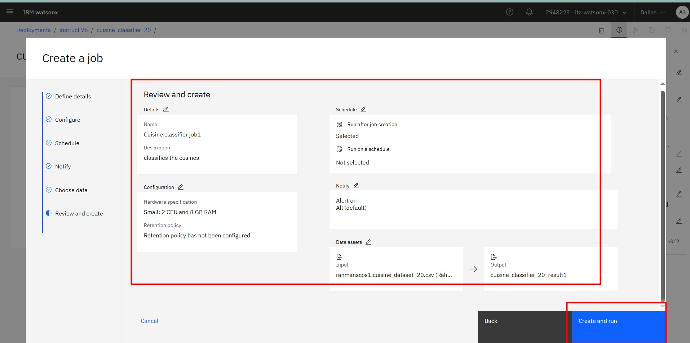
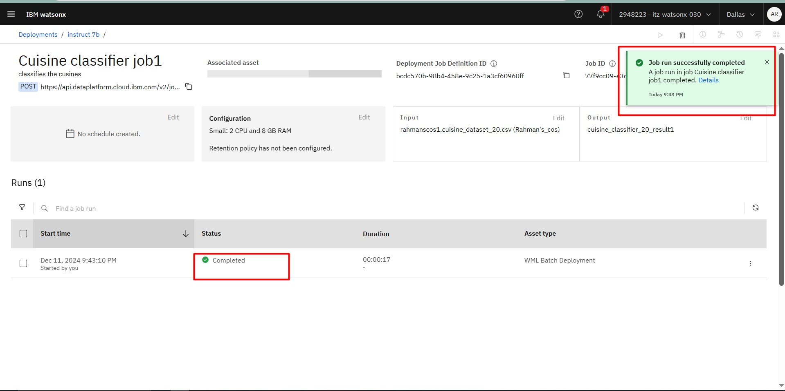
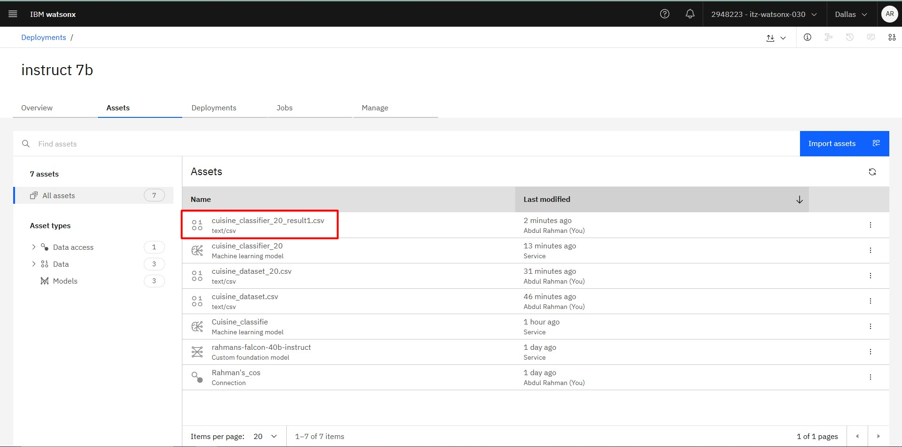

# Introduction

IBM watsonx.ai  enables you to import machine learning models trained outside of its environment. The models can be stored in the watsonx.ai  repository (a Cloud Object Storage bucket) and optionally deployed for testing.

## Ways to Import Models

1. **Directly through the UI**
2. **By using a path to a file**
3. **By using a path to a directory**

### Steps to Import a Model Using the UI

1. Navigate to the **Assets** tab in your watsonx.ai  space.
2. Click **Import assets**.

3. Select **Local file**, then **Model**.

4. Choose the model file and click **Import**.
   - The system will automatically select a matching model type based on the version string in the file.

   

### Supported Frameworks and Import Options

| Import Option                        | Spark MLlib | Scikit-learn | XGBoost | TensorFlow | PyTorch |
|--------------------------------------|-------------|--------------|---------|------------|---------|
| Importing a model object             | ✓           | ✓            | ✓       |            |         |
| Importing a model via a file path    |             | ✓            | ✓       | ✓          | ✓       |
| Importing a model via a directory    |             | ✓            | ✓       | ✓          | ✓       |

**Note:** Models in PMML format can be imported directly by uploading the `.xml` file.

---

# Creating Batch Deployments

Batch deployments process input data from files or data connections and write the output to a specified destination. Unlike online deployments, batch deployments are designed for asynchronous processing.

## Steps to Create a Batch Deployment from UI

1. Organize resources in a deployment space, adding deployable assets and data files.
2. Deploy the asset (e.g., machine learning model) with **Batch** as the deployment type.

3. Configure the batch deployment job by specifying the above in **new job**:

   - Input data location
   - Output data destination
     
   

   - Scheduling details (if needed)

   

4. Click **Create**. The status will change to **Deployed** upon successful creation.   

 

5. Run the job, which processes the input data and writes the output to the specified location.

### Supported Asset Types for Batch Deployment

- **Models**: AutoAI, Scikit-learn, TensorFlow, XGBoost, Spark MLlib, PyTorch-ONNX, PMML, SPSS Modeler
- **Scripts**: Python scripts
- **Functions**: Python functions, Decision Optimization models

### Testing Batch Deployments

1. Create a batch job from the deployment space.
2. Define the job, including input data and run schedule.
3. Run the job manually or as per the schedule.
4. View or download the output from the **Assets** page.

 

---
 
# Conclusion

IBM watsonx.ai provides powerful tools for managing AI workflows, from importing models to executing batch deployments. Use this guide to streamline your AI model deployment and processing tasks.

Happy Deploying! 🎉
