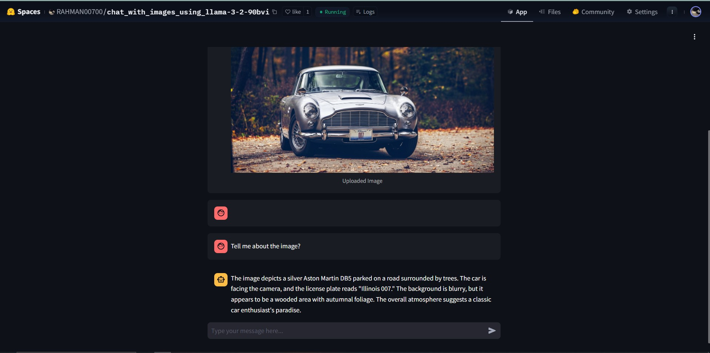

# Introduction

Welcome to the future of AI-powered image analysis! IBM has recently released advanced vision models as part of their Watson AI suite. These models combine cutting-edge image recognition with conversational AI capabilities, allowing users to analyze images and ask questions about their contents seamlessly.

In this blog, we’ll explore how to build a simple **Streamlit application** to interact with these models. Whether you’re analyzing photos, diagrams, or charts, this app can provide insights and context through intelligent conversations.

---

## 🎯 What Makes IBM’s Vision Models Unique?

IBM’s latest vision models, like the **Meta-LLaMA 3-2-90b Vision Instruct**, are designed to:

1. **Analyze Visual Data**: Extract meaningful insights from images, from object recognition to contextual understanding.
2. **Enable Conversational Interaction**: Use natural language to query images, blending vision and language capabilities.
3. **Empower Developers**: Simplify integration into apps using intuitive APIs.

**Key Features:**
- Seamless integration with Streamlit for rapid prototyping.
- High accuracy in visual and conversational tasks.
- Easy-to-use Watson API for streamlined development.

---

## 🚀 Building the Chat with Images App

Let’s dive into creating a **Streamlit** app that connects with IBM’s vision models. This app allows users to upload an image, analyze it using the Watson AI model, and interact with it via chat.



### Prerequisites

1. An **IBM Cloud Account** with access to Watson AI services.
2. **Python** installed on your machine.
---

## 🛠️ Code Implementation

### Part 1: Setup and Environment Configuration

This section initializes necessary libraries, loads environment variables, and provides utility functions for image conversion and authentication.

```bash
import streamlit as st
import base64
from PIL import Image
import os
from dotenv import load_dotenv
import requests

# Load environment variables
load_dotenv()
api_key = os.getenv("IBM_API_KEY")

def convert_image_to_base64(uploaded_file):
    """Convert uploaded image to Base64 format."""
    bytes_data = uploaded_file.getvalue()
    base64_image = base64.b64encode(bytes_data).decode()
    return base64_image

def get_auth_token(api_key):
    """Retrieve authentication token using IBM API key."""
    auth_url = "https://iam.cloud.ibm.com/identity/token"

    headers = {
        "Content-Type": "application/x-www-form-urlencoded",
        "Accept": "application/json"
    }

    data = {
        "grant_type": "urn:ibm:params:oauth:grant-type:apikey",
        "apikey": api_key
    }

    response = requests.post(auth_url, headers=headers, data=data, verify=False)

    if response.status_code == 200:
        return response.json().get("access_token")
    else:
        raise Exception("Failed to get authentication token")
```

### Part 2: User Interaction and State Management

Here, we define the app’s main logic, including file upload handling, chat state initialization, and chat message rendering.

```bash
def main():
    st.title("Chat with Images")

    # Initialize chat history and uploaded file state
    if "messages" not in st.session_state:
        st.session_state.messages = []
    if "uploaded_file" not in st.session_state:
        st.session_state.uploaded_file = None

    # Clear uploaded image button
    if st.session_state.uploaded_file:
        if st.button("Clear Uploaded Image"):
            st.session_state.uploaded_file = None
            st.session_state.messages = []

    # User input: Upload an image
    uploaded_file = st.file_uploader("Choose an image...", type=["jpg", "jpeg", "png"])
    if uploaded_file is not None:
        st.session_state.uploaded_file = uploaded_file
        image = Image.open(uploaded_file)
        with st.chat_message("user"):
            st.image(image, caption='Uploaded Image', use_container_width=True)
            base64_image = convert_image_to_base64(uploaded_file)
            st.session_state.messages.append({"role": "user", "content": [{"type": "image_url", "image_url": {"url": f"data:image/png;base64,{base64_image}"}}]})

    # Display chat messages
    for msg in st.session_state.messages[1:]:
        if msg['role'] == "user":
            with st.chat_message("user"):
                if msg['content'][0]['type'] == "text":
                    st.write(msg['content'][0]['text'])
        else:
            st.chat_message("assistant").write(msg["content"])

```

### Part 3: API Integration and Response Handling

This part handles API requests to Watson’s model, processes the responses, and updates the chat interface.

```bash
    # User input: Chat message
    user_input = st.chat_input("Type your message here...")

    if user_input:
        message = {"role": "user", "content": [{"type": "text", "text": user_input}]}
        st.session_state.messages.append(message)
        st.chat_message(message['role']).write(user_input)

        # Prepare and send API request
        url = "https://us-south.ml.cloud.ibm.com/ml/v1/text/chat?version=2023-05-29"

        model_messages = []
        latest_image_url = None
        for msg in st.session_state.messages:
            if msg["role"] == "user" and isinstance(msg["content"], list):
                content = []
                for item in msg["content"]:
                    if item["type"] == "text":
                        content.append(item)
                    elif item["type"] == "image_url":
                        latest_image_url = item
                if latest_image_url:
                    content.append(latest_image_url)
                model_messages.append({"role": msg["role"], "content": content})
            else:
                model_messages.append({"role": msg["role"], "content": [{"type": "text", "text": msg["content"]}] if isinstance(msg["content"], str) else msg["content"]})

        body = {
            "messages": [model_messages[-1]],
            "project_id": "833c9053-ef07-455e-819f-6557dea2f8bc",
            "model_id": "meta-llama/llama-3-2-90b-vision-instruct",
            "decoding_method": "greedy",
            "repetition_penalty": 1,
            "max_tokens": 900
        }

        try:
            YOUR_ACCESS_TOKEN = get_auth_token(api_key)

            headers = {
                "Accept": "application/json",
                "Content-Type": "application/json",
                "Authorization": f"Bearer {YOUR_ACCESS_TOKEN}"
            }

            response = requests.post(
                url,
                headers=headers,
                json=body
            )

            if response.status_code == 200:
                res_content = response.json()['choices'][0]['message']['content']
                if isinstance(res_content, list):
                    res_content = " ".join([item.get("text", "") for item in res_content])
                st.session_state.messages.append({"role": "assistant", "content": res_content})
                with st.chat_message("assistant"):
                    st.write(res_content)
            else:
                error_message = "Sorry, I couldn't process your request. Please try again later."
                st.session_state.messages.append({"role": "assistant", "content": error_message})
                with st.chat_message("assistant"):
                    st.write(error_message)

        except Exception as e:
            st.error(f"An error occurred: {e}")

if __name__ == "__main__":
    main()

```

## To run this program

### 1. Save the above three parts in a single app.py file
### 2. Create a requirements.txt file with the following content:
  
```bash 
streamlit
requests
Pillow
python-dotenv
```
### 3. Setting Up and Running

Set Up a Virtual Environment (Optional):
```bash
python -m venv venv
source venv/bin/activate  # For Windows: `venv\Scripts\activate`

```
### 4. Install Dependencies

```bash
pip install -r requirements.txt
```
### 5. Run the app

```bash
streamlit run app.py
```
## 6.🎉 Try the Live App [Live app](https://huggingface.co/spaces/RAHMAN00700/chat_with_images_using_llama-3-2-90bvi) in your browser.

## Summary

**Part 1**: Sets up essential libraries, authentication, and utility functions.
**Part 2**: Manages user input, file uploads, and chat session states.
**Part 3**: Integrates with IBM’s Watson AI API and handles AI-driven responses.

Now you can build your app to combine visual data with conversational AI capabilities! 🚀

