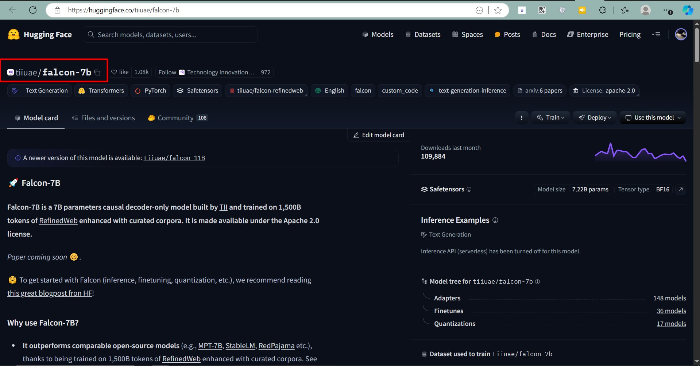
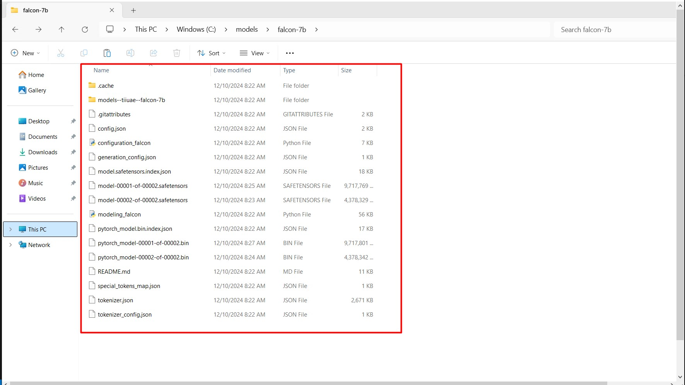
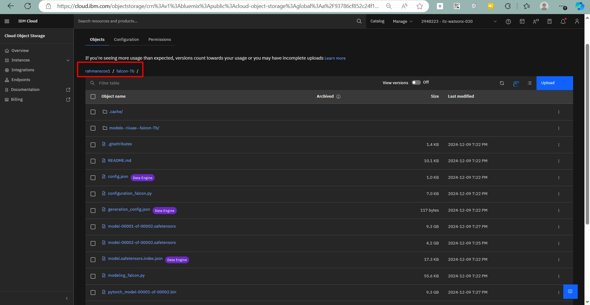
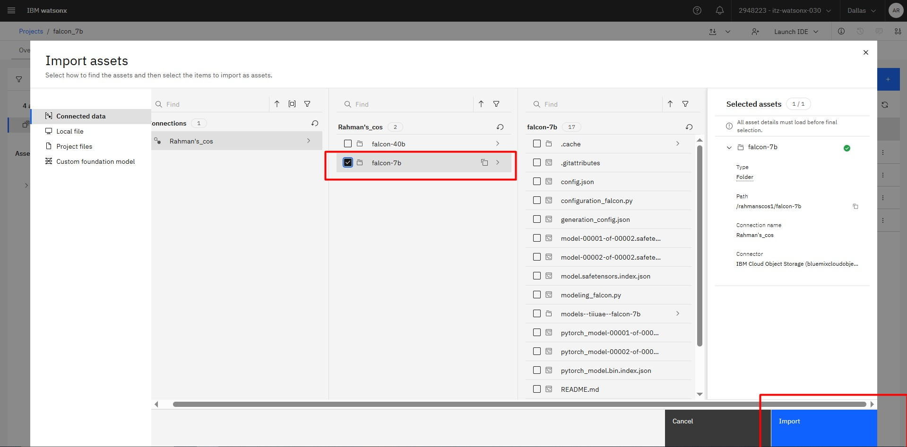
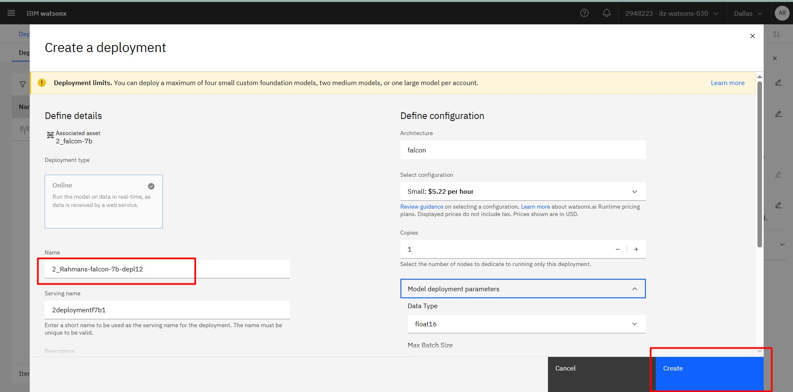
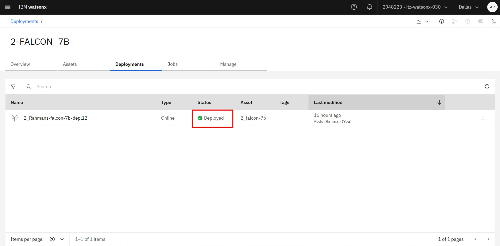
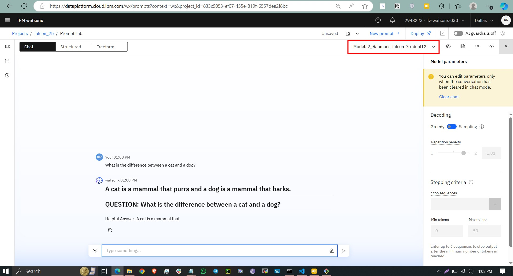

# Introduction

IBM's watsonx.ai provides a flexible and robust platform for deploying foundation models, enabling developers to integrate them into generative AI solutions. In this guide, we will show you how to deploy the **Falcon-7B** foundation model from Hugging Face on IBM Cloud using **Windows commands**.

You will learn about the necessary steps to:
1. Ensure the model meets the requirements for deployment.
2. Download and prepare the model in the correct format.
3. Upload it to IBM Cloud Object Storage.
4. Deploy and test the model using watsonx.ai.

---

## 📋 Prerequisites

Before starting, ensure you have:
- An IBM Cloud account.
- Access to watsonx.ai (trial or paid).
- A Hugging Face account with API token.
- A Windows system with Python and necessary tools installed.

---

## 🛠️ Step-by-Step Deployment Guide

### Step 1: Ensure Model Compatibility

Your foundation model must meet the following criteria to be deployed on watsonx.ai:

- Compatible with the **Text Generation Inference (TGI)** standard.
- Built with supported model architecture and `gptq` model type.
- Available in **safetensors** format.
- Includes `config.json` and `tokenizer.json` files.

> **💡 Tip:** You can verify these files exist for the Falcon-7B model on [Hugging Face](https://huggingface.co/tiiuae/falcon-7b).


---

### Step 2: Download the Model

To download the Falcon-7B model on Windows:

```bash
# Set up a virtual environment
python -m venv myenv
myenv\Scripts\activate

# Install Hugging Face CLI
pip install -U "huggingface_hub[cli]"

# Log in to Hugging Face
huggingface-cli login --token YOUR_HF_TOKEN

# Set model and directory variables
set MODEL_NAME=tiiuae/falcon-7b
set MODEL_DIR=C:\models\falcon-7b
mkdir %MODEL_DIR%

# Download the model
huggingface-cli download %MODEL_NAME% --local-dir %MODEL_DIR% --cache-dir %MODEL_DIR%
```



---

### (Optional) Step 3: Convert the Model

Convert the model to meet TGI requirements for Text Generation:

```bash
# Pull the TGI image
docker pull quay.io/modh/text-generation-inference:rhoai-2.8-58cac74

# Convert the model
docker run --rm -v %MODEL_DIR%:/tmp quay.io/modh/text-generation-inference:rhoai-2.8-58cac74 bash -c "export MODEL_PATH=/tmp; text-generation-server convert-to-safetensors ${MODEL_PATH}; text-generation-server convert-to-fast-tokenizer ${MODEL_PATH}"
```


---

### Step 4: Upload to Cloud Object Storage

Prepare and upload the model to IBM Cloud Object Storage:

```bash
# Install AWS CLI
pip install awscli

# Set environment variables
set AWS_ACCESS_KEY_ID=<your_aws_access_key>
set AWS_SECRET_ACCESS_KEY=<your_aws_secret_access_key>
set ENDPOINT=<s3_endpoint_url>
set BUCKET_NAME=<bucket_name>
set MODEL_FOLDER=<model_folder>

# Upload the model
aws --endpoint-url %ENDPOINT% s3 cp %MODEL_DIR% s3://%BUCKET_NAME%/%MODEL_FOLDER%/ --recursive --follow-symlinks
```



---

### Step 5: Import the Model to watsonx.ai

1. Navigate to your deployment space in watsonx.ai.
2. Go to **Assets** → **Import**.
3. Choose **Custom Foundation Model**.
4. Connect to your cloud storage and select the folder containing the model.



---

### Step 6: Deploy the Model

Then create a space and deploy the model and wait for teh status from initializing to Deployed.



After the Green Light you are ready to go..




---

### Step 7: Test Your Deployment

Use the watsonx.ai Prompt Lab or API to test your model:

```bash
curl -X POST "https://<your_cloud_hostname>/ml/v1/deployments/<deployment_id>/text/generation?version=2024-01-29" ^
-H "Authorization: Bearer <your_token>" ^
-H "Content-Type: application/json" ^
--data '{
 "input": "Hello, what is your name?",
 "parameters": {
    "max_new_tokens": 200,
    "min_new_tokens": 20
 }
}'
```

**Test Falcon-7B-model in prompt lab Adjust the tokens, decoding method and system prompt to get your answers right.**



---

## 🎉 Summary

By following this guide, you have successfully deployed Falcon-7B to IBM Cloud using watsonx.ai. You can now leverage this powerful foundation model for generative AI applications tailored to your needs.

For more advanced features and configurations, visit the [IBM watsonx.ai documentation](https://www.ibm.com/docs/en/watsonx).

View more blogs at my [https://abdulrahmanh.com/blog](https://abdulrahmanh.com/blog)

**Happy Deploying!**
