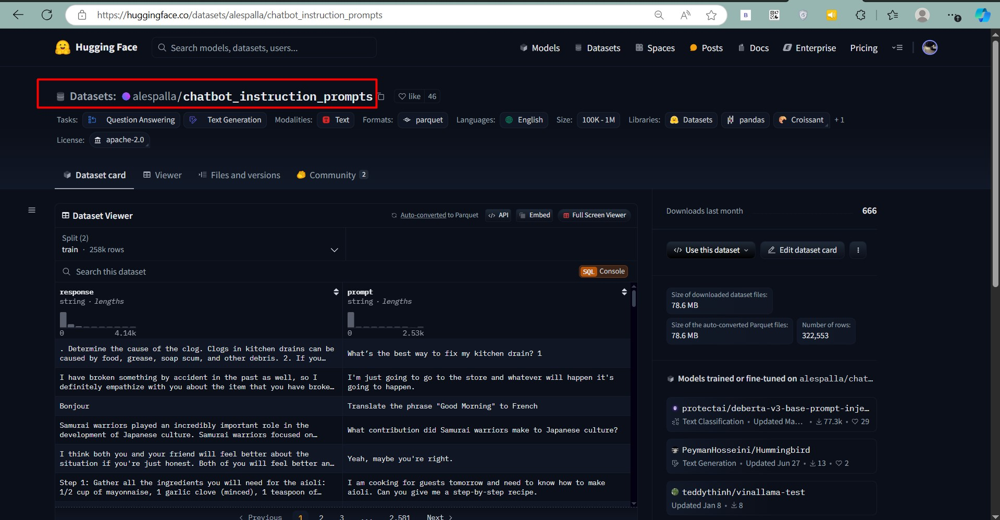
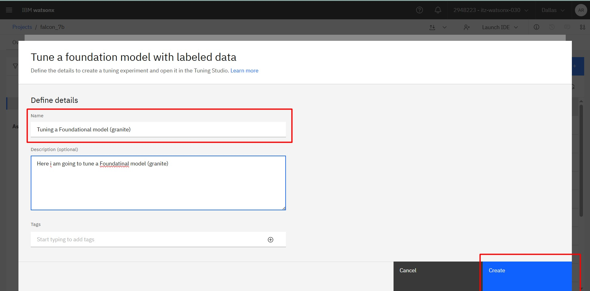
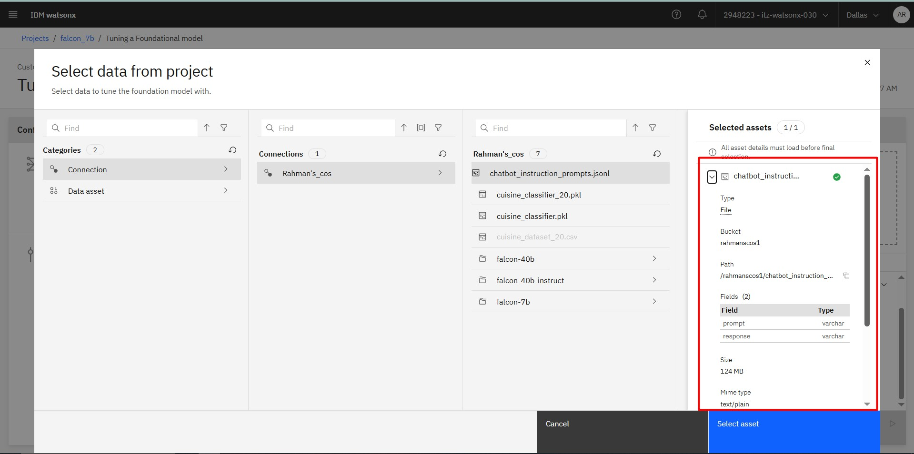
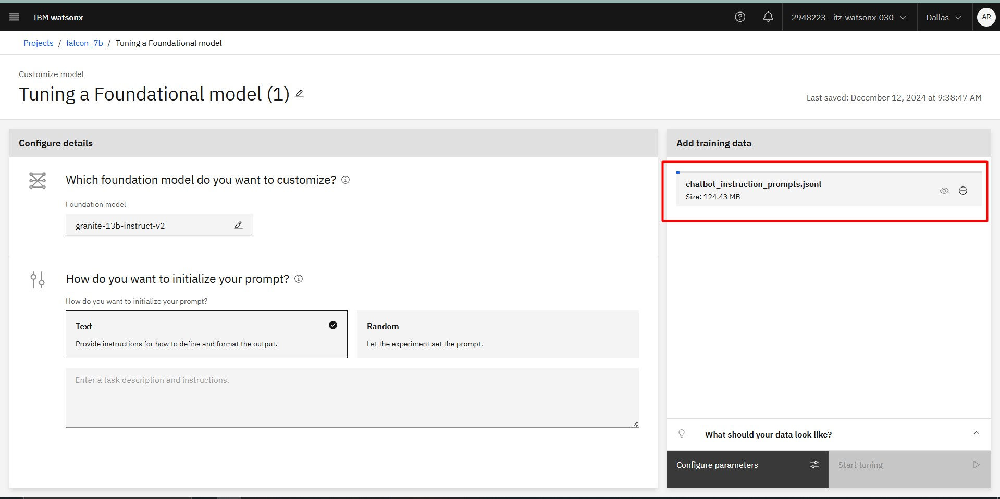
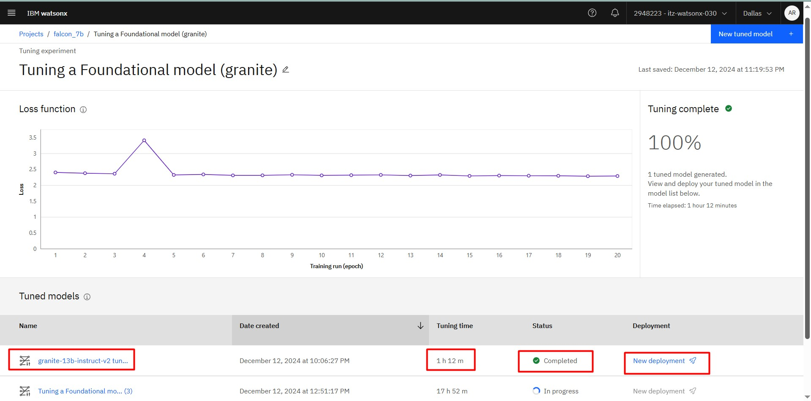
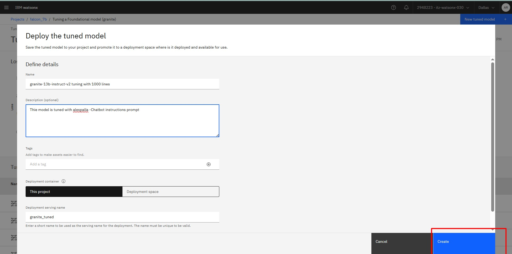
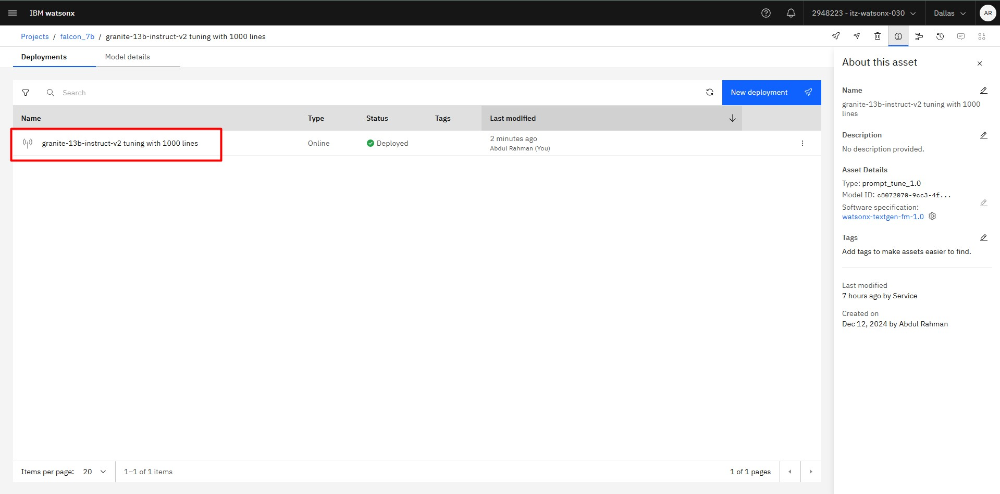
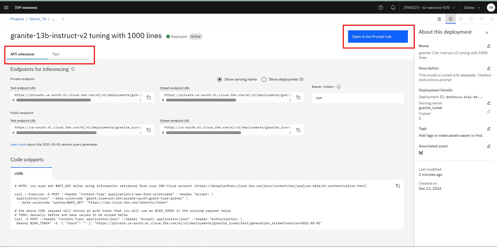
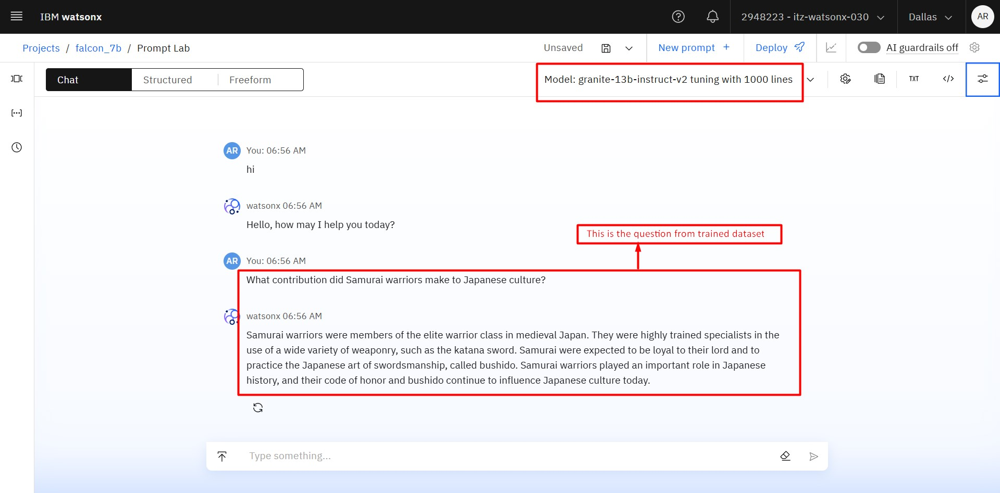
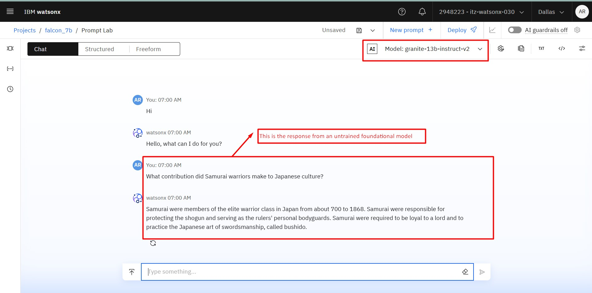

# Introduction

Tuning a foundation model is a crucial step in customizing AI systems to generate desired outputs efficiently. This guide provides an in-depth walkthrough of how to perform prompt tuning for foundation models using Watsonx.ai, including setting up a tuning experiment and optimizing for specific tasks.

---

## Requirements

Before diving into tuning, ensure you have access to the **Projects** in Watsonx.ai. Note that availability varies by plan and data center. Confirm the foundation models available for tuning in your region.

To begin, a default project named `sandbox` is created for Watsonx.ai users. If you don’t see this project, create one manually by following these steps:

1. Expand **Projects** from the main menu and click **All projects**.
2. Click **New project**.
3. Name your project and optionally add a description.
4. Click **Create**.

For additional project options like reporting or logging, refer to the **Creating a project**
---

## 🛠️ Before You Begin

Make decisions about the following tuning options:

1. **Select the Foundation Model**:
   - Choose a model that aligns with your use case.  

2. **Prepare Example Prompts**:
   - Create example prompts based on your prompt engineering work. 

---
## Download the datasets from Hugging face

1. **Dataset Details**:
   - In this Project I am using the [alespalla/chatbot_instructions_prompts](https://huggingface.co/datasets/alespalla/chatbot_instruction_prompts)

   

2. **Download and clean the dataset**:
   - Download the dataset and change into json or jsonl format (eg.input-output fromat) 

3. **Upload the dataset to IBM cos or You can Upload it manually**   

## 🔧 How to Tune a Foundation Model

### Step 1: Start a Tuning Experiment

1. From the Watsonx.ai home page, select your project.
2. Click **New asset > Tune a foundation model with labeled data**.
3. Name your tuning experiment and optionally add a description and tags.
4. Click **Create**.

   

### Step 2: Choose a Foundation Model

1. Click **Select a foundation model**.
2. Browse through available models and view detailed information by selecting their tiles.
3. Once decided, click **Select**.

### Step 3: Upload the dataset and Initialize the Prompt
Upload the dataset from cos or manually

   

Choose one of the following initialization options:
- **Text**: Provide specific initialization text.
- **Random**: Let the system generate initialization values.

   

#### Adding Initialization Text

For the **Text** method, provide task-specific instructions:
- **Classification**: Include task details and class labels, e.g., *Classify sentiment as Positive or Negative.*
- **Generation**: Provide a detailed request, e.g., *Generate an email promoting remote work.*
- **Summarization**: Specify objectives, e.g., *Summarize meeting highlights.*

### Step 4: Specify the Task Type

Select the task type that fits your goal:
- **Classification**: Assign categorical labels.
- **Generation**: Produce text outputs.
- **Summarization**: Extract main ideas from text.

   

#### For Classification Tasks
Add the desired class labels, ensuring they match your training data. For example:
- *Positive*
- *Negative*

### Step 5: Add Training Data

1. Upload training data or use an existing project asset.
2. To preview data format templates, expand **What should your data look like?**
3. Optionally, adjust the maximum tokens allowed for input and output to optimize processing time.

### Step 6: Configure Tuning Parameters

1. Edit parameter values for the tuning experiment by clicking **Configure parameters**.
2. After adjustments, click **Save**.

### Step 7: Start Tuning

Click **Start tuning** to begin the experiment. The duration depends on the dataset size and compute resource availability. Once complete, the status will display as **Completed**.

   

---

## 🧩 Tips for Token Management

Tokens are key units for natural language processing. Adjust token limits to optimize performance:
- **Maximum Input Tokens**: Controls input size (e.g., 256 tokens).
- **Maximum Output Tokens**: Limits generated output size (e.g., 128 tokens).

### Example
For classification tasks, reduce output size to encourage concise results (e.g., *Positive* or *Negative*).

---

## 📊 Evaluating the Tuning Experiment

The experiment results include a loss function graph that visualizes model improvement:
- **X-axis**: Epochs.
- **Y-axis**: Difference between predicted and actual results.

---

## 🔧 Deploy a Tuned Model

### Steps to Deploy:

1. From the navigation menu, expand **Projects** and click **All projects**.
2. Select your project and navigate to the **Assets** tab.
3. Open the tuning experiment associated with the model you wish to deploy.
4. From the **Tuned models** list, locate the completed experiment and click **New deployment**.

 

5. Provide a name for the tuned model. Optionally, add a description and tags.
6. Select a deployment container:
   - **This project**: For testing within the project.
   - **Deployment space**: For production-ready deployment.

Click **Deploy** to complete the process.
  
   

## 🔍 Testing the Deployed Model

### Test Options:

- **Project**: Ideal for development and testing phases.
- **Deployment space**: Test programmatically or via the API Reference tab.
- **Prompt Lab**: Offers an intuitive interface for detailed prompting and testing.

  

#### Testing in Prompt Lab:
1. Open the deployed model in the project or deployment space.
2. Click **Open in Prompt Lab**.
3. Input a prompt tailored to the model’s tuning and click **Generate**.

### Trained Model response 
This is the output generated from the trained granite model

   

### Without Trained Model response 
This the normal output from the untrained model

 

---

## Conclusion

Tuning foundation models allows for customization that aligns AI outputs with your specific needs. By following this guide, you’ll maximize the potential of Watsonx.ai for your use cases.
