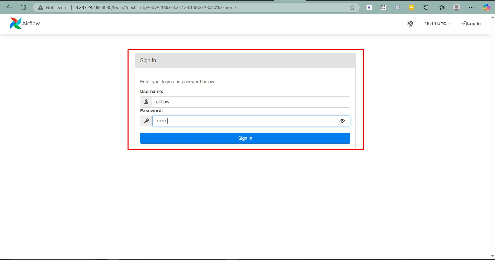
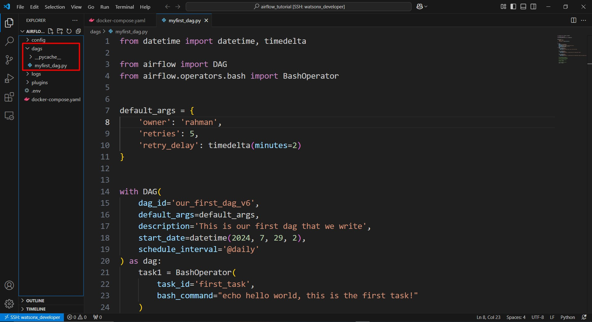
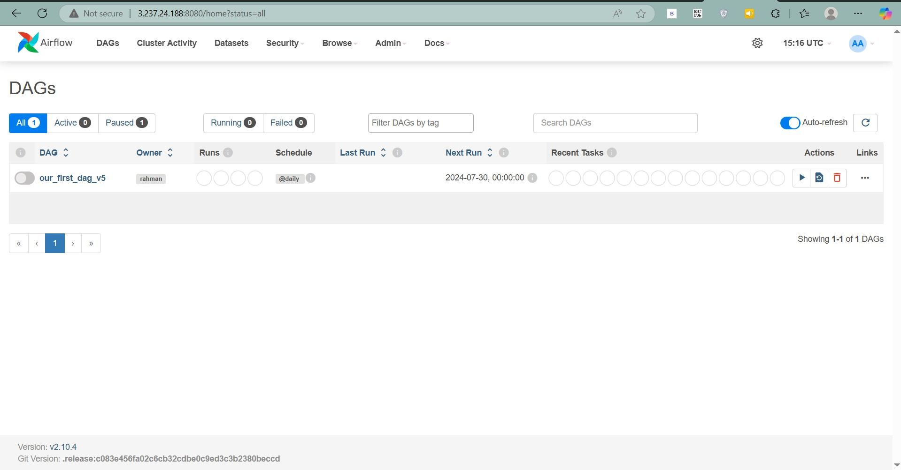
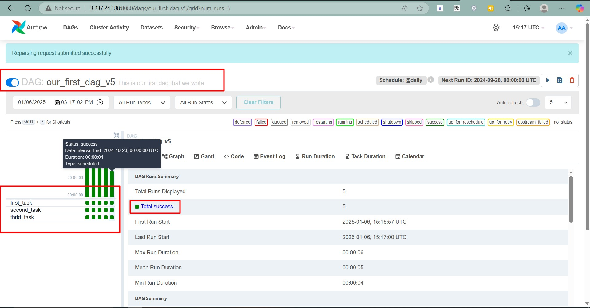
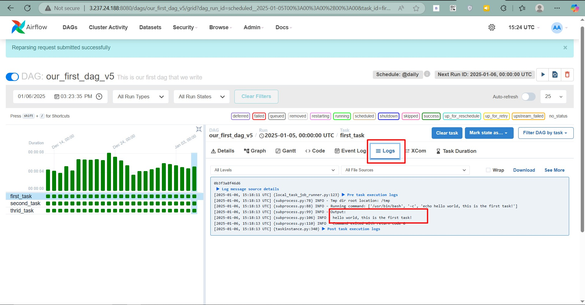

# Introduction

Apache Airflow is an open-source platform to programmatically author, schedule, and monitor workflows. It enables data engineers and developers to manage workflows efficiently with a rich UI and dynamic pipeline creation using Python.

In this guide, you will learn how to install Airflow using Docker, explore its components and architecture, and create your first DAG (Directed Acyclic Graph) using BashOperator.

---

## ⚡ Overview of Apache Airflow

Apache Airflow provides a powerful and flexible way to programmatically orchestrate workflows. Here’s a quick breakdown of its architecture:

### Components:
- **Scheduler**: Monitors tasks and DAGs, triggering task instances once dependencies are met.
- **Webserver**: Provides a rich user interface to manage workflows.
- **Worker**: Executes tasks assigned by the scheduler.
- **Triggerer**: Runs an event loop for deferrable tasks.
- **Database**: Stores metadata about workflows and tasks.
- **Executor**: Defines how tasks are executed (e.g., CeleryExecutor for distributed execution).

### Architecture Overview:
Airflow uses a **centralized metadata database** to track workflows, and its components interact through this database. Workflows are defined in Python scripts as **DAGs**, which describe dependencies and execution order.

---

## 🛠️ Installing Apache Airflow Using Docker

### Prerequisites
Ensure the following are installed:
- Docker ([Installation Guide](https://docs.docker.com/get-docker/))
- Docker Compose ([Installation Guide](https://docs.docker.com/compose/install/))

### Fetching `docker-compose.yaml`
To deploy Airflow using Docker Compose, download the `docker-compose.yaml` file:

```bash
curl -LfO 'https://airflow.apache.org/docs/apache-airflow/2.10.4/docker-compose.yaml'
```

**Important**: From July 2023, Compose V1 stopped receiving updates. Upgrade to a newer version of Docker Compose to ensure compatibility.

This file defines several services:
- **airflow-scheduler**: Monitors and schedules workflows.
- **airflow-webserver**: Accessible at `http://localhost:8080`.
- **airflow-worker**: Executes tasks.
- **airflow-triggerer**: Manages deferrable tasks.
- **airflow-init**: Initializes the Airflow environment.
- **postgres**: Airflow metadata database.
- **redis**: Message broker between scheduler and worker.

Optionally, enable Flower (a monitoring tool) by running:

```bash
docker compose --profile flower up
```

Flower will be available at `http://localhost:5555`.

---

### Setting Up the Environment

#### Step 1: Set the Right Airflow User
On Linux:

```bash
mkdir -p ./dags ./logs ./plugins ./config
echo -e "AIRFLOW_UID=$(id -u)" > .env
```

For other OS, create an `.env` file manually with:

```bash
AIRFLOW_UID=50000
```

#### Step 2: Initialize the Database
Run the following to initialize the environment and database:

```bash
docker-compose up airflow-init
```

You should see a message indicating successful initialization:

```
airflow-init_1       | Upgrades done
airflow-init_1       | Admin user airflow created
airflow-init_1       | 2.10.4
start_airflow-init_1 exited with code 0
```

#### Step 3: Start Airflow
Start all services:

```bash
docker-compose up
```

Access the Airflow UI at `http://localhost:8080` with the username `airflow` and password `airflow`.



---

### Cleaning Up
To clean up the environment:

1. Stop services and remove volumes:

```bash
docker-compose down --volumes --remove-orphans
```

2. Remove the directory containing `docker-compose.yaml`:

```bash
rm -rf '<DIRECTORY>'
```

3. Re-download `docker-compose.yaml` and start again.

---

## ✍️ Writing Your First DAG

### Steps to Create and Run Your First DAG

1. Create a Python file (e.g., `first_dag.py`) in the `./dags` folder with the following content:

```python
from datetime import datetime, timedelta
from airflow import DAG
from airflow.operators.bash import BashOperator

default_args = {
    'owner': 'rahman',
    'retries': 5,
    'retry_delay': timedelta(minutes=2)
}

with DAG(
    dag_id='our_first_dag_v6',
    default_args=default_args,
    description='This is our first dag that we write',
    start_date=datetime(2024, 7, 29, 2),
    schedule_interval='@daily'
) as dag:
    task1 = BashOperator(
        task_id='first_task',
        bash_command="echo hello world, this is the first task!"
    )

    task2 = BashOperator(
        task_id='second_task',
        bash_command="echo hey, I am task2 and will be running after task1!"
    )

    task3 = BashOperator(
        task_id='third_task',
        bash_command="echo hey, I am task3 and will be running after task1 at the same time as task2!"
    )

    task1 >> [task2, task3]
```


2. Save the file and refresh the Airflow UI (`http://localhost:8080`).



3. Locate the newly added DAG, enable it, and click on the DAG to view its details.



4. Trigger the DAG run manually by clicking the play button.

5. Monitor the job status in the UI. You can view logs for each task by clicking on it in the Graph View or Tree View.



6. Verify the job completion and review logs for insights.

---

With these steps, you have successfully installed Apache Airflow using Docker, created a DAG, and monitored its execution. Happy workflow orchestration!
