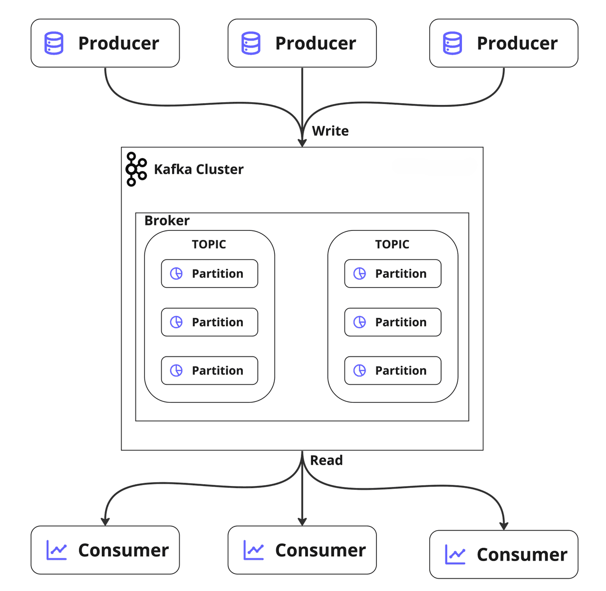
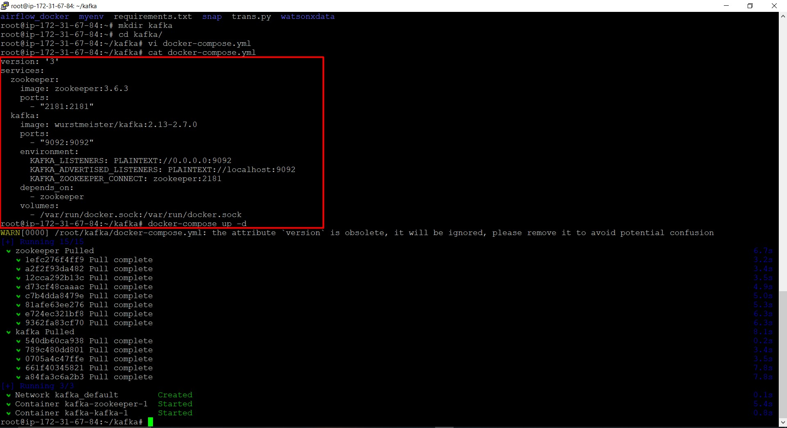
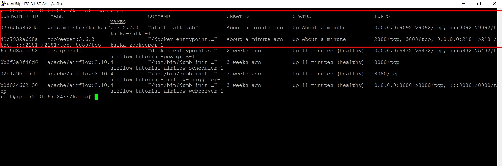
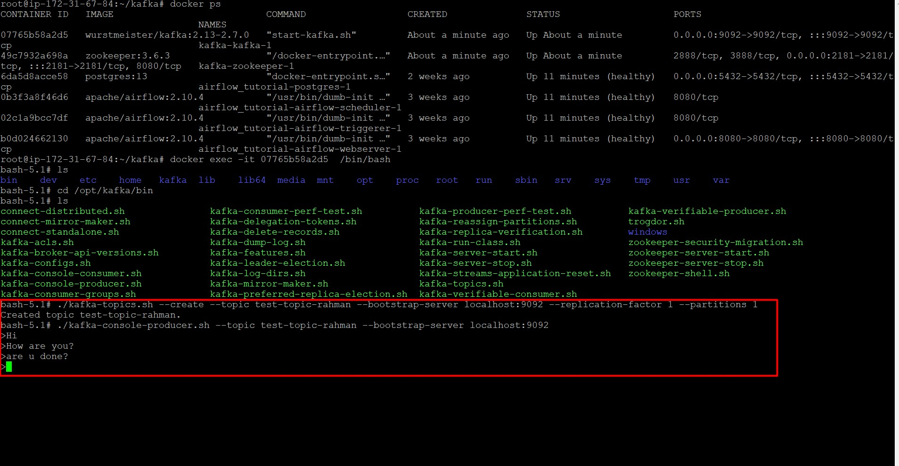
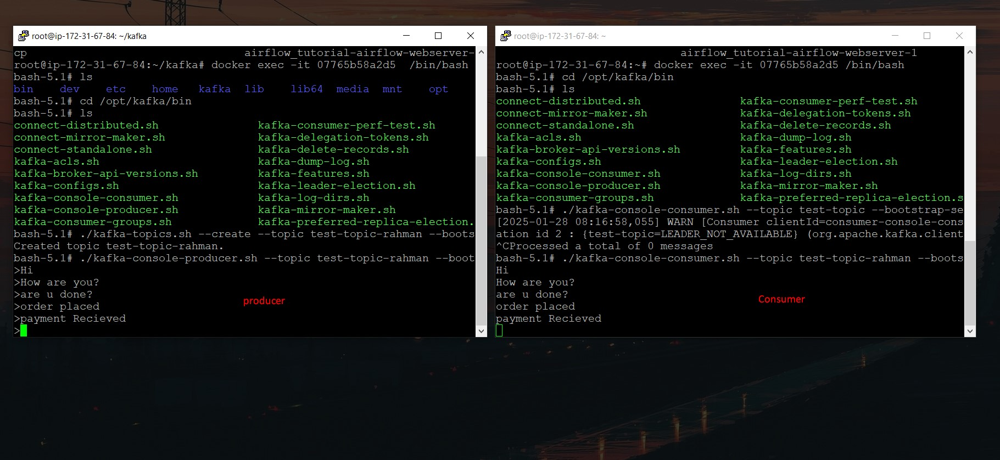

# Introduction

Apache Kafka is a distributed event-streaming platform designed for high-throughput, fault-tolerant, real-time data processing. From building event-driven architectures to powering critical business operations, Kafka is a go-to tool for data engineers and developers alike.

In this blog, we will dive deep into Kafka's architecture, set up a Kafka environment using Docker Compose, and explore commands to manage topics, producers, and consumers.

---

## ⚙️ Kafka Architecture Overview

Kafka's architecture comprises the following components:

1. **Producers**: Send messages to Kafka topics.
2. **Topics**: Logical channels where data is organized.
3. **Partitions**: Subdivisions within a topic that enable parallel processing.
4. **Consumers**: Read messages from topics.
5. **Brokers**: Kafka servers that handle message storage and distribution.
6. **ZooKeeper**: Manages cluster metadata and coordination.



### Key Features:
- Distributed and Fault-Tolerant
- Horizontal Scalability
- Real-Time Stream Processing
- Exactly-Once Semantics

---

## 🛠 Setting Up Kafka with Docker Compose

To get started with Kafka, we will set up a local Kafka environment using Docker Compose. Below is the `docker-compose.yml` configuration:

```yaml
docker-compose.yml
version: '3'
services:
  zookeeper:
    image: zookeeper:3.6.3
    ports:
      - "2181:2181"

  kafka:
    image: wurstmeister/kafka:2.13-2.7.0
    ports:
      - "9092:9092"
    environment:
      KAFKA_LISTENERS: PLAINTEXT://0.0.0.0:9092
      KAFKA_ADVERTISED_LISTENERS: PLAINTEXT://localhost:9092
      KAFKA_ZOOKEEPER_CONNECT: zookeeper:2181
    depends_on:
      - zookeeper
    volumes:
      - /var/run/docker.sock:/var/run/docker.sock
```


### Steps to Run:
1. Save the above content into a file named `docker-compose.yml`.
2. Open a terminal and navigate to the directory containing the file.
3. Run the command:

   ```bash
   docker-compose up -d
   ```

4. Verify that the Kafka and Zookeeper containers are running using:

   ```bash
   docker ps
   ```
   

---

## 🚀 Hands-On with Kafka Commands

Once your Kafka setup is running, follow these steps to interact with Kafka.

### Access Kafka Container

To access the Kafka container, execute:

```bash
docker exec -it <kafka_container_id> /bin/bash
```



### Locate Kafka Binaries

Inside the container, navigate to the Kafka binaries:

```bash
cd /opt/kafka/bin
```

### Creating a Topic

Create a new topic named `test-topic`:

```bash
./kafka-topics.sh --create --topic test-topic --bootstrap-server localhost:9092 --replication-factor 1 --partitions 1
```

### Running a Kafka Producer

To send messages to the `test-topic`, run the producer:

```bash
./kafka-console-producer.sh --topic test-topic --bootstrap-server localhost:9092
```
Type messages in the terminal and press Enter to send them.



### Running a Kafka Consumer

To consume messages from `test-topic`:

1. Open a new terminal and access the Kafka container.
2. Navigate to the Kafka binaries:

   ```bash
   cd /opt/kafka/bin
   ```

3. Run the consumer:

   ```bash
   ./kafka-console-consumer.sh --topic test-topic --bootstrap-server localhost:9092 --from-beginning
   ```

After that when you send query from producer, it will reflected in consumer terminal quickly.

   

### Creating a Topic with Multiple Partitions

Create a topic named `test-topic-two` with three partitions:

```bash
./kafka-topics.sh --create --topic test-topic-two --bootstrap-server localhost:9092 --replication-factor 1 --partitions 3
```

If the topic already exists, you will receive an error message.

---

## 📊 Deep Dive into Topics and Partitions

### What Are Partitions?
Partitions divide a topic into smaller, manageable chunks, enabling parallelism and scalability. Each partition can be processed by a separate consumer.

### Key-Value Advantage
Messages can be routed to specific partitions based on keys, ensuring data locality for related events.

---

## 🔍 Troubleshooting Tips

### Checking Existing Topics
List all topics in the Kafka cluster:

```bash
./kafka-topics.sh --list --bootstrap-server localhost:9092
```

### Viewing Topic Details
Describe a topic to inspect its configuration:

```bash
./kafka-topics.sh --describe --topic test-topic --bootstrap-server localhost:9092
```

### Debugging Producer and Consumer
- If the producer or consumer cannot connect, verify that the Kafka container is running and reachable on port 9092.
- Check the logs of the Kafka container:

  ```bash
  docker logs <kafka_container_id>
  ```

---

## 🌐 Conclusion

Congratulations! You have successfully set up Kafka, created topics, and interacted with producers and consumers. With this knowledge, you are equipped to dive deeper into advanced Kafka features such as stream processing with Kafka Streams, connecting external systems using Kafka Connect, and deploying Kafka clusters in production.

**Happy Streaming!**
