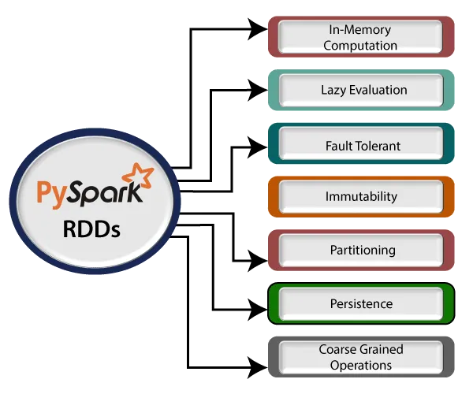
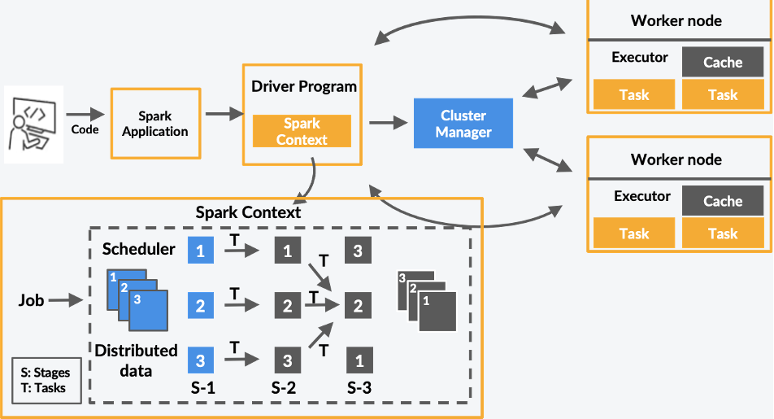
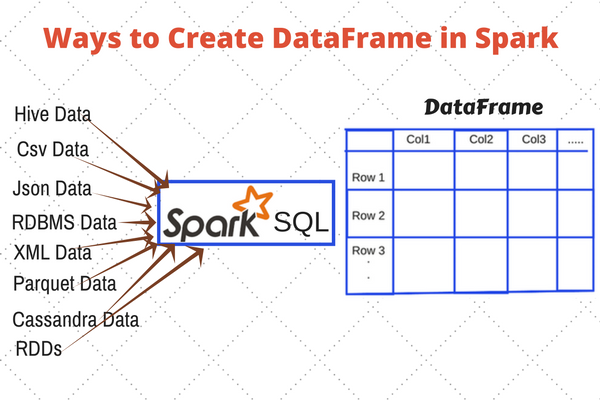
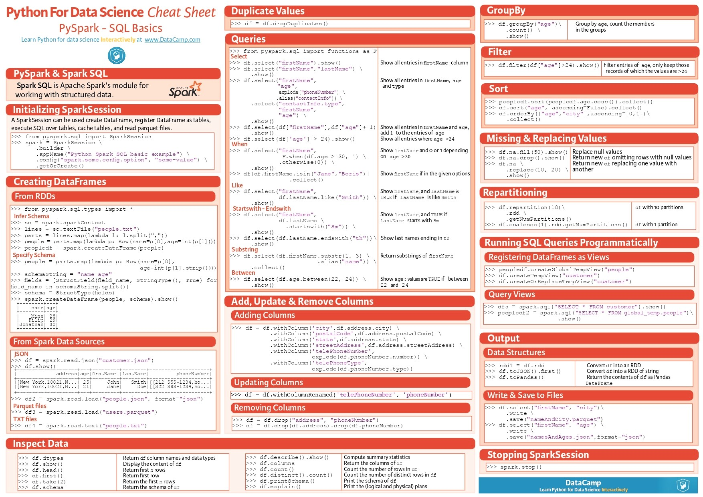

# Introduction

In the era of big data, processing large datasets efficiently is crucial. **Apache Spark**, an open-source distributed computing system, has become a go-to tool for handling massive data workloads. **PySpark** is its Python API, making it easier for data engineers and analysts to work with Spark using Python.

In this guide, we will explore PySpark's architecture, key components, and practical commands to help you get started with big data processing.

---

## 🔥 What is PySpark?

**PySpark** is the Python interface for **Apache Spark**, allowing users to leverage Spark’s powerful distributed computing capabilities using Python. It is widely used for big data analytics, machine learning, and ETL (Extract, Transform, Load) processes.

### Why Learn PySpark?

- 🚀 **Handles large datasets efficiently**
- ⏳ **Faster than traditional frameworks like Pandas for big data**
- 🔀 **Works seamlessly with distributed computing clusters**
- ☁️ **Supports cloud platforms like Databricks and Google Cloud**

---

## 🏗 PySpark Architecture

PySpark follows a **distributed computing model**, breaking large tasks into smaller ones that run in parallel. Its architecture includes:

### 1️⃣ Driver Program

- The **driver** is the main control program that runs the **SparkContext**.

### 2️⃣ Cluster Manager

- Allocates resources across a **cluster** (e.g., YARN, Mesos, Kubernetes, or Standalone mode).

### 3️⃣ Executors

- Run tasks assigned by the driver and store data in memory or disk.

### 4️⃣ RDDs (Resilient Distributed Datasets)

- The fundamental data structure in Spark, ensuring fault tolerance and parallel processing.



---

## 🛠 Setting Up PySpark

You can install PySpark using pip:

```bash
pip install pyspark
```

To start PySpark in an interactive mode:

```bash
pyspark
```

For Jupyter Notebook users:

```bash
pip install jupyter findspark
```

Then, in Python:

```python
import findspark
findspark.init()
import pyspark
from pyspark.sql import SparkSession

spark = SparkSession.builder.appName("MyApp").getOrCreate()
print(spark)
```



---

## 📊 PySpark Components

PySpark consists of several key components:

### 1️⃣ SparkContext

- The entry point to Spark’s core functionality.

```python
from pyspark import SparkContext
sc = SparkContext("local", "MyApp")
print(sc)
```

### 2️⃣ SparkSession

- The unified entry point for working with DataFrames and Datasets.

```python
from pyspark.sql import SparkSession
spark = SparkSession.builder.appName("MyApp").getOrCreate()
```

### 3️⃣ RDDs (Resilient Distributed Datasets)

- Immutable, distributed collections of data.

```python
rdd = sc.parallelize([1, 2, 3, 4, 5])
print(rdd.collect())  # [1, 2, 3, 4, 5]
```

### 4️⃣ DataFrames

- Similar to Pandas DataFrames but optimized for distributed processing.

```python
data = [("Alice", 25), ("Bob", 30)]
columns = ["Name", "Age"]
df = spark.createDataFrame(data, columns)
df.show()
```



---

## ⚡ Essential PySpark Commands

| Function                                  | Description                        |
| ----------------------------------------- | ---------------------------------- |
| `df.show()`                               | Displays the DataFrame             |
| `df.printSchema()`                        | Prints schema of DataFrame         |
| `df.select("col")`                        | Selects a specific column          |
| `df.filter(df["col"] > value)`            | Filters data                       |
| `df.groupBy("col").count()`               | Groups data and counts occurrences |
| `df.orderBy("col")`                       | Sorts data                         |
| `df.withColumn("new_col", df["col"] * 2)` | Adds a new column                  |

Example:

```python
df.show()  # Displays the DataFrame
```

---

## 📌 PySpark Cheat Sheet



---

## 🎯 Tips to Learn PySpark Faster

- ✅ Start with small datasets before moving to big data.
- ✅ Practice using **DataFrames** and **RDDs** in Jupyter Notebook.
- ✅ Explore official documentation and community resources.
- ✅ Work on real-world datasets to solidify concepts.
- ✅ Try cloud-based platforms like **Databricks** for hands-on experience.

---

## 🎯 Conclusion

PySpark is a powerful tool for processing big data at scale. With its support for distributed computing and cloud platforms like Databricks, it is a must-have for any data engineer. This guide covered:

- PySpark architecture & components
- Essential commands & DataFrame operations

Now you’re ready to dive deeper into big data processing with PySpark! 🚀

**Happy Pysparking!**
